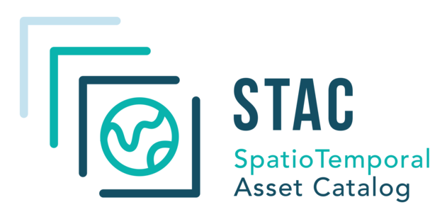
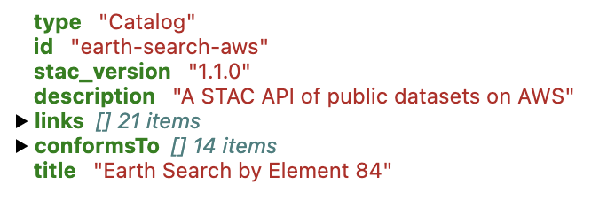
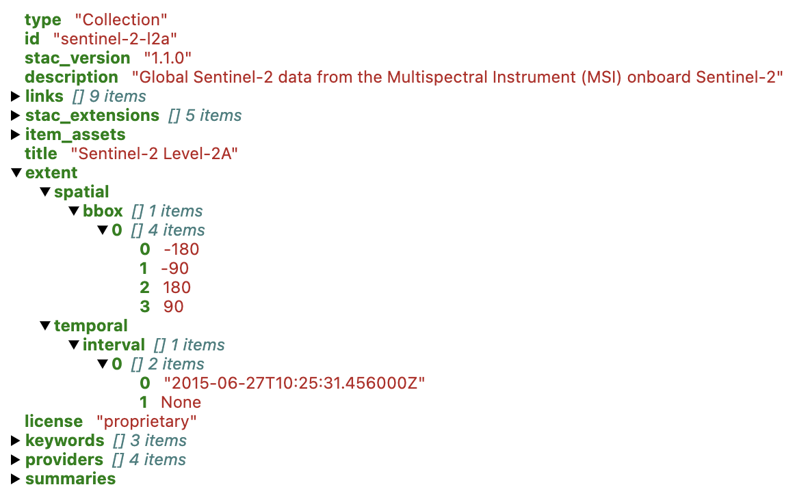
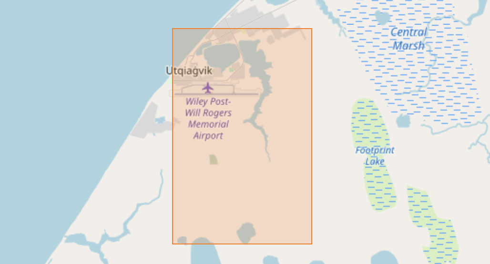
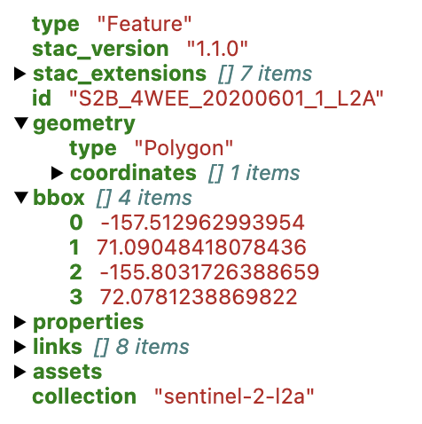
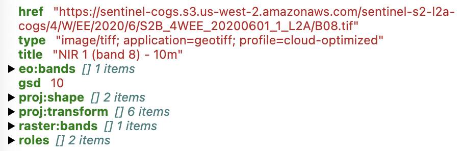
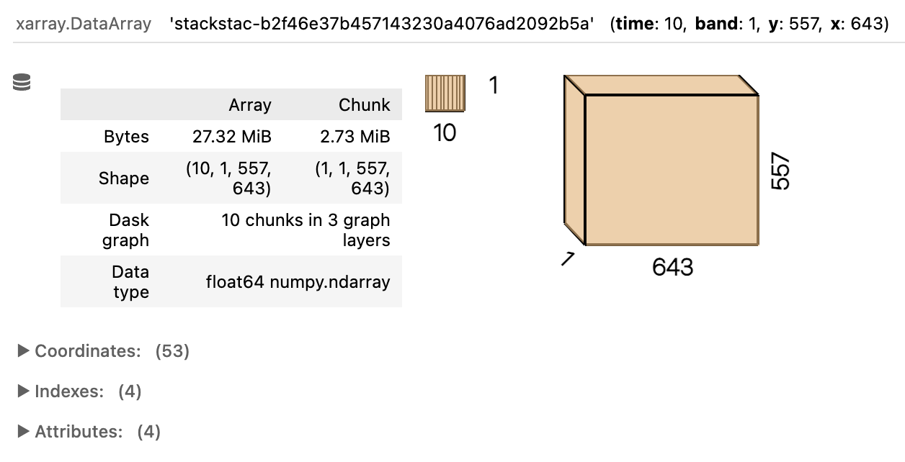
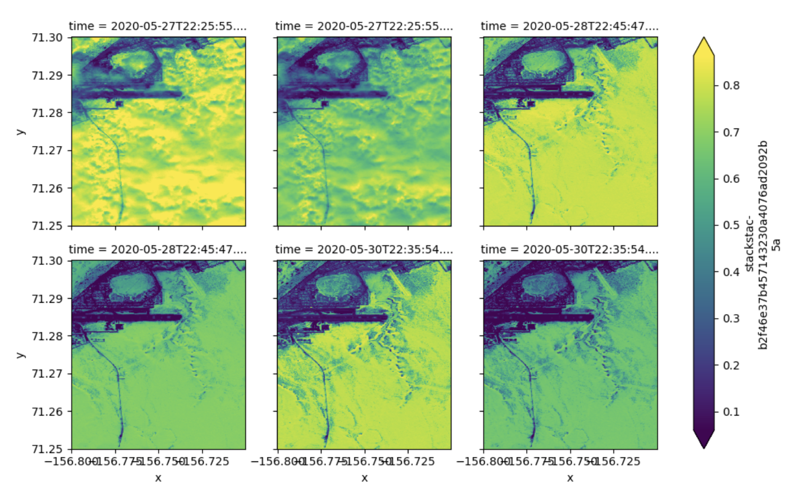
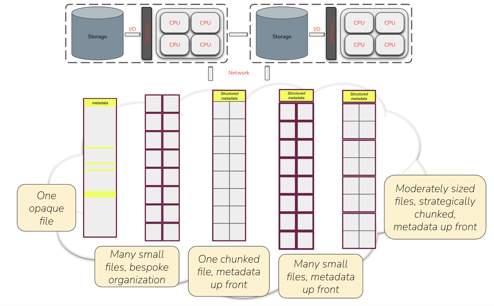

## Learning Objectives

- Review the big picture of computational challenges in large-scale data analysis
- Recap various workshop technologies and how they all fit together
- Learn about cloud optimized data formats and access patterns
- Consider the present and future of cloud-native geospatial data

## Introduction

This course has focused on **scalable computing** in the Arctic domain.
In a nutshell, that means _going big_ with our computing and data
processing, and being equipped to deal with the challenges that arise
when scaling up. But what exactly is it that can _be_ big, what problems
arise as a consequence, and what are the corresponding solutions?  We've
talked about how we can run into bottlenecks in CPU, memory, I/O, and
network, but let's step back and consider two major and distinct types
of scaling challenges:

::: {layout-ncol="2"}

:::{.callout-note icon=false}
### Processing Intensity Challenges

**What can be big?**

The _**number of tasks**_ we need to complete, especially factoring in
the amount of time it takes to complete each task, and our overall time
constraints. Too much work to do!

**What tends to limit us?**

- CPU/GPU speed
- Maybe I/O or network speed

**What can we do about it?**

- Faster processors
- Algorithmic optimization
- Parallel computation
:::

:::{.callout-note icon=false}
### Data Volume Challenges

**What can be big?**

The _**amount of data**_ we have to process, especially considering the
peak volume data we need to handle at a given time, relative to our
space constraints. Too much stuff to hold at once!

**What tends to limit us?**

- Memory capacity
- Storage capacity

**What can we do about it?**

- Chunked processing
- Distributed storage
- Data simplification
:::
:::

If your fundamental challenge is task volume, then aside from speeding
up computation by using faster processors and/or faster algorithms, the
natural solution (when permitted by the structure of the problem) is to
transition to parallel processing, spreading tasks out across multiple
cores, processors, and/or nodes. We've covered approaches to this using
Python's multithreading and multiprocessing capabilities, along with
Parsl as a full-fledged parallel programming library.

If your fundamental challenge is data volume, then barring budget and
means to sufficiently scale up your memory and storage capacity, the
solution in one form or another is to split the data into pieces,
working with each piece in turn. Interestingly, by decomposing a dataset
into many small parts to act on independently, we often end up with a
task architecture amenable to parallelization, allowing us to not only
overcome the data volume problem but also reduce our task duration! This
is one of the benefits we get from working with data-centric
parallelization frameworks like Dask, with its distributed dataframes
and arrays.

In the remainder of this chapter, we will primarily focus on the data
volume challenge, in particular exploring how different decisions about
data storage formats and layouts enable (or constrain) us as we attempt
to work with data at large scale. We'll formalize a couple of concepts
we've alluded at throughout the course, introduce a few new
technologies, and characterize the current state of best practice --
with caveat that this is an evolving area!

## Cloud optimized data

As we've seen, when it comes global and even regional environmental
phenomena observed using some form of remote-sensing technology, much of
our data is now _cloud-scale_. In the most basic sense, this means many
datasets -- and certainly relevant collections of datasets that you
might want to analyze together -- no longer fit in local storage. So
instead we put it in the massive, "infinitely" scalable cloud, where it
is distributed across potentially many networked storage backends.

::: {.callout-caution icon=false}
### Moving to the cloud
The migration of data into the cloud also frees us up (and may compel
us, for better or worse) to move our compute to the cloud as well, for
example by running our data analysis on cloud-hosted virtual machines.
It frees us up in the sense that because the data is no longer local,
and we need to learn tools and techniques for efficiently accessing
remote data from arbitrary locations over the network, it becomes less
of a lift for us to transition to remote computing as well. And this can
be beneficial when the compute platform is "near" the data, reducing
network and perhaps even I/O latency. However, to the extent that
realizing these benefits may require committing to some particular
commercial cloud provider (with its associated cost structure), this may
or may not be desirable change.
:::

Practically speaking, accessing data in the cloud means using HTTP to
request and receive data. Compared with traditional local storage, each
read operation is much, much slower using HTTP over the internet than
when reading a file on a local storage device, and the throughput (i.e.,
the number of bytes you can move per second) is much lower. Although we
can't change these basic differences, we can _optimize_ our data to
reduce their impact. We'll talk about _how_ in a moment. But first
consider two other cloud-centric developments over the past handful of
years:

1. _Video over the web_. Millions (if not billions) of users consume
   multidimensional array data every day over the web, streaming video
   from services like YouTube, Netflix, Twitch, TikTok, and many other
   providers. Data access is fast, and at any given moment, our phones,
   TVs, and other devices are requesting and receiving just the small
   chunks of data they need.
2. _Web-scale, web-enabled databases_. In the Zarr section, we marveled
   at our ability to quickly pull a tiny bit of data from a
   multi-terabyte data store in the cloud. But consider that we do this
   kind of thing all the time every day when we browse the web and use
   all manner of web services (either directly or indirectly): we
   request and receive small bits of data from what are often large,
   distributed data stores, powered by fast, modern database and
   database-like systems sitting behind web APIs.

Accessing and manipulating data from massive satellite product
collections and other large environmental data arrays isn't exactly the
same problem, but it has some common attributes. Indeed, the
cloud-native geospatial vision is to be able to provision and process
big environmental geospatial data in similarly convenient and performant
ways, using a combination of optimized storage architecture and matching
optimized client-side technologies for working with that data. .

### Cloud Optimized GeoTIFFs (COGs)

As we've discussed elsewhere in this course, geospatial rasters are a
specialization of multi-dimensional arrays. First of all, they are
inherently 2-dimensional, with dimensions corresponding to a geospatial
coordinate system. Conceptually, we may have additional dimensions
insofar as a "complete" raster data set may involve a set of rasters at
different dates and times (temporal dimension), or corresponding to
different spectral bands. Nevertheless, the standard paradigm is to
treat these as a collection of 2D arrays (potentially stored within a
single file), and leave it up to users to combine them as needed.

Today, best practice is to store geospatial rasters as [Cloud Optimized
GeoTIFFs](https://cogeo.org/), known as COGs. COGs are a relative
newcomer among raster file formats. They first emerged in the
mid-2010s, and were approved as an [official standard of the Open
Geospatial Consortium
(OGC)](https://www.ogc.org/announcement/cloud-optimized-geotiff-cog-published-as-official-ogc-standard/)
in 2023. However, COGs _are_ GeoTIFFs, which have been around since the
1990s, and GeoTIFFs are TIFFs, which date back to the 1980s. Let's work
our way through this linage.

First we have the original **TIFF** format, which stands for Tagged Image
File Format. Although we often think of TIFFs as image files, they're
actually _file containers_ for images, insofar as a single TIFF file can
store multiple raster images. In brief, TIFF have a file header - i.e.,
metadata - encoded in the bytes at the beginning of the file. Among
other things, this header points to another batch of metadata (called an
_image file directory_, or IFD) for a first image. This IFD contains
information about where the image bytes themselves are located in the
file, and also points to the IFD of a second image (if there is one),
and so on. True to its name, TIFFs internally rely on so-called _tags_ -
simple data structures that store various attributes and properties - to
capture information clients need to properly interpret and render the
contained images. TIFFs also rely heavily on internal compression of
the image data, using one of a few well-known lossless compression
algorithms.

Next we have **GeoTIFFs**. GeoTIFFs are simply TIFFs with special tags
that store geospatial information: how the image bounds relate to
locations on the earth, coordinate reference system, datum, ellipsoid,
projection.  That's about all there is to it.

Finally we have **COGs**. COGs are GeoTIFFs that following some specific
conventions, none of which are required by the GeoTIFF standard itself,
but all of which are compliant with it:

::: {layout="[1,1,1]"}

::: callout-tip
### Metadata up front

All IFD bytes (i.e., the metadata for all contained images) are laid out
sequentially at the beginning of the file, after the standard TIFF
header. Readers don't need to follow a chain of offsets to discover what
the TIFF contains or where images are located in the file; they simply
need to read a sufficiently large number of initial bytes.
:::

::: callout-tip
### Tiled data

The main raster data is broken into tiles (i.e., rectangular chunks)
which are each individually compressed, and all stored in a particular
sequential order. Tiling means individual raster values from nearby
pixels tend to be close to each other in the file, indeed usually within
the same compressed tile.
:::

::: callout-tip
### Overviews

A set of overviews (lower resolution tile pyramids) are computed from
the main full resolution data and stored in the file, again following a
tiling scheme and and arranged in order. This allows clients to load a
lower resolution version of the data when appropriate, without needing
to read the full resolution data itself.
:::

:::

To reiterate, all of these are just restrictions on the GeoTIFF format,
so a COG _is_ a GeoTIFF. However, because of its deliberate design,
clients can access relevant spatial subsets of a (potentially very
large) raster by making just a few reads of discrete portions of the
file. This is hugely important when accessing the data over HTTP --
hence the "cloud optimized" moniker - because each HTTP read operation
is far more time-consuming than the same corresponding read would be for
a local disk read. Provided the data is hosted on a web server that
accepts [range requests](https://en.wikipedia.org/wiki/Byte_serving) for
specific sections of a file rather than returning the entire file, we
can access relevant chunks of data in a targeted and efficient
manner.

Here is a rough sketch of what happens when a user wants data from a COG
for some specific geographic area at 100m resolution, which we'll assume
is coarser than the full resolution in a COG. First the client makes an
initial HTTP range request large enough to capture all metadata in most
cases, e.g. the first 16 kilobytes of the file.  This provides enough
information to understand the file structure, georeferencing
information, internal tile structure including overviews, and byte
offsets to all overview and tile indexes. The client is then able to
make precise HTTP range requests for the specific bytes needed for any
particular desired subset of the image at a particular resolution
(either full or reduced), by converting the geographic coordinates of
the desired bounding box into pixel coordinates, then identifying which
tile(s) in the COG intersect with the area of interest, then determining
the associated byte ranges of the tile(s) based on the metadata read in
teh first step. And the best part is that "client" here refers to the
underlying software, which takes care of all of the details. As a user,
typically all you need to do is specify the file location, area of
interest, and desired overview level (if relevant)!

### Cloud-optimized data principles

How do we generalize the cloud-friendly features of COGs? It really
comes down to two things:

The first is __*consolidating metadata and making it available "up
front"*__. A consumer should be able to start by reading metadata only,
ideally getting all of the essential metadata in one single read
operation, without knowing anything else. This metadata should be
sufficient for the client to determine not only what the dataset
contains, but also exactly where to go to get any specific subset(s) of
the overall available data.

The second is __*storing data in chunks, each of which can be accessed
independently*__. Equal parts art and science, chunks should be
reasonably sized -- not too big, not too small -- with chunk
configuration (shape) optimized for expected usage patterns. This
enables a client interested in a subset of data to retrieve the relevant
data without receiving too much additional unwanted data. In addition,
chunk layout should be such that, under expected common usage patterns,
proximal chunks are morely likely to be requested together. On average,
this will reduce the number of separate read requests a client must
issue to retrieve and piece together any particular desired data subset.
In addition, chunks should almost certainly be compressed with a
suitable compression algorithm.  Compression incurs some additional
compute time for decompression, but with a net benefit because it
reduces the total number of bytes transferred over the relatively slow
network connections we experience in the cloud setting.

Together, these characteristics enable clients to efficiently (i.e.,
with a small number of read operations transferring minimal unwanted
data) execute _partial reads_ of data, and furthermore to speed things
up by doing _parallel reads_ of distinct sections of data.

To reiterate what we discussed in the COGs section, this is all
deliberately designed to work well with HTTP range requests, a mechanism
whereby clients can request specific byte ranges of a web-accessible
resource. Through the combination of a smart chunk layout on one hand,
with metadata up front on other hand, clients can quickly determine
where to get data of interest, and then retrieve efficiently via HTTP
range requests.

### Zarr, revisited

Now that we understand what cloud optimized data formats are all about,
let's go back and revisit Zarr. Is it cloud friendly?

- __*Metadata up front*__. In Zarr stores, we expose metadata through
  external JSON files. Clients start by reading the metadata to
  determine where relevant data chunks live. Moreover, Zarr supports
  creation of [consolidated
  metadata](https://github.com/zarr-developers/zarr-specs/pull/309),
  whereby the metadata for all groups and arrays in a given Zarr store
  is packaged into a single metadata file in the root of the store, so
  that clients can access all of this information in a single read.
- __*Chunked data*__. Indeed, this is foundational to Zarr. Recall that
  Zarr is a storage specification for chunked, compressed N-dimensional
  arrays. Moreover, these chunks can be store in various ways -- not
  only in memory and in conventional disk-based file systems, but also
  in cloud-based object storage such as Google Cloud Storage, Amazon S3,
  and Azure Blob Storage.

So by these criteria, yes, Zarr is certainly a cloud-friendly format!

But wait, there's more! As of early 2025 with its V3 release, Zarr has
introduced an important new cabilility around _sharding_, which controls
how chunks are allocated to files. Previously, each chunk was compressed
and stored as a separate file, but now multiple compressed chunks can be
stored in the same file (referred to as a "shard"). In other words, the
choice of how to break the data into separately compressed and
addressable subsets is now decoupled from the choice of how to break the
data into separate files; a massive dataset can be segmented into a very
large number of small chunks without necessarily creating a
correspondingingly large number of small individual files, which can
cause problems in certain contexts. In some sense, this allows a Zarr
store to behave a little more like a COG, with its many small,
addressable tiles contained in a single file.

### Cloud-optimized netCDF files?

What about all those netCDF files out in the wild? Although one option
would be to convert these into a cloud optimized format like Zarr, it
turns out there's another approach that can work well. Especially in
cases where the netCDF file already has well-designed internal chunking
and sensible compression -- both features already supported by the
specification -- the only other thing we really need is relevant
metadata up front. We can achieve this by creating Zarr-like metadata
that fully describes the data in an external JSON file, pointing at
byte-addressed segments of the relevant netCDF file(s) rather than
independent data files/objects stored in native Zarr format. Sometimes
referred to as virtual Zarr stores, these can be created using libraries
such as [kerchunk](https://fsspec.github.io/kerchunk/) and
[VirtualiZarr](https://virtualizarr.readthedocs.io/en/latest/).

If the original source netCDF files are not effectively chunked
(internally) for your relevant analysis use cases, virtual Zarr stores
aren't going to help much. In that case, it may be better to convert the
data (or the desired subset of data) into a proper Zarr store with
better chunking. However, in other cases, the virtual Zarr approach can
work quite well, typically yielding more or less equivalent read
performance between the two approaches.

## SpatioTemporal Asset Catalogs (STAC)

Today we have data, data, everywhere, made available by many providers
in multiple formats. Across this landscape, how can we effectively find
data of interest for a particular place and time, and quickly understand
how to access, ingest, and use each individual data resource?
Historically, organizations publishing data over the web have each used
their own ad hoc methods for documenting and cataloging available files.
For example, recall in the Zarr chapter when we downloaded and searched
through a large CSV file to find paths to relevant CMIP6 datasets.
Wouldn't it be nice if all providers agreed to a common cataloging
approach, so we didn't have to figure out the idiosyncrasies of each
scheme? This is exactly the problem that [STAC](https://stacspec.org/en)
is designed to solve.

::: {layout-ncol="2"}

STAC is a specification for describing spatiotemporal data assets,
intended to facilitate the search and discovery of relevant data
collected at some place and time on Earth, especially based on spatial
and/or temporal queries of interest.



:::

To work with STAC, you need to be comfortable with the following terms:

+----------------+--------------------------------------------------------+
| STAC term      | Description                                            |
+================+========================================================+
| **Asset**      | A file representing information about the Earth,       |
|                | captured at some place and time                        |
+----------------+--------------------------------------------------------+
| **Item**       | A document describing one or more assets associated    |
|                | with a given place and time, with metadata describing  |
|                | that place (as a GeoJSON feature), time, and various   |
|                | other properties                                       |
+----------------+--------------------------------------------------------+
| **Collection** | A document describing a _set_ of items and/or child    |
|                | collections, with metadata describing their collective |
|                | spatiotemporal extent, and other various properties    |
+----------------+--------------------------------------------------------+
| **Catalog**    | A grouping of items, collections, and/or other child   |
|                | catalogs                                               |
+----------------+--------------------------------------------------------+
| **Link**       | A reference to a related resource either in the        |
|                | catalog (e.g., related items) or outside the catalog   |
|                | (e.g. documentation)                                   |
+----------------+--------------------------------------------------------+

STAC catalogs come in two variants. The simpler form is a _static
catalog_, achieved by simply publishing STAC-compliant JSON files on the
web. Clients can read these files, walk through the linked information
to identify and explore component collections and items, and ultimately
get to the associated data via asset links.

The second form is a _dynamic API_. This requires more setup by the
catalog publisher, including provisioning of an API server, but it
enables more powerful catalog interactions such as dynamic search.

Let's take a quick peek at how we can use Python, including the
[pystac-client](https://github.com/stac-utils/pystac-client) library, to
navigate a STAC catalog and ultimately retrieve some data, borrowing
from [this online
tutorial](https://www.geodose.com/2024/02/pystac-decoded-step-by-step-tutorial.html).
We'll use Earth Search by Element 84, a STAC catalog implemented as a
dynamic API. Before we dive into the code, you may want to have a look
at the [web-based catalog
browser](https://stacindex.org/catalogs/earth-search#/), which can be
useful for interactive exploration.

:::{.callout-note appearance="simple"}
In this book we've simply included static screenshots of the output, but
in a Jupyter notebook or similar interactive environment, you would be
able to expand various sections and drill into the hierarchical depths
of the returned information.
:::

First let's connect to the top-level catalog.

```{python}
#| eval: false
from pystac_client import Client
uri = 'https://earth-search.aws.element84.com/v1'
catalog = Client.open(uri)
catalog
```
{width="60%"}

Now we'll see what collections are stored at the Catalog level.

```{python}
#| eval: false
collection_list = list(catalog.get_collections())
print(f"Catalog contains {len(collection_list)} collections")
for collection in collection_list:
    print(f'- [{collection.id}] {collection.title}')
```

```
Catalog contains 9 collections
- [sentinel-2-pre-c1-l2a] Sentinel-2 Pre-Collection 1 Level-2A
- [cop-dem-glo-30] Copernicus DEM GLO-30
- [naip] NAIP: National Agriculture Imagery Program
- [cop-dem-glo-90] Copernicus DEM GLO-90
- [landsat-c2-l2] Landsat Collection 2 Level-2
- [sentinel-2-l2a] Sentinel-2 Level-2A
- [sentinel-2-l1c] Sentinel-2 Level-1C
- [sentinel-2-c1-l2a] Sentinel-2 Collection 1 Level-2A
- [sentinel-1-grd] Sentinel-1 Level-1C Ground Range Detected (GRD)
```

Let's dive into the `sentinel-2-l2a` collection.

In the returned widget, look at some of the details. Especially take
note of the **extent** field, which contains information about the
_spatial_ and _temporal_ coverage of this collection. This is central to
STAC! In this case, the collection has global bounds, with a time period
beginning in June 2015 and continuing today.

```{python}
#| eval: false
sentinel_collection_id = 'sentinel-2-l2a'
catalog.get_collection(sentinel_collection_id)
```
{width="100%"}

What does this collection contain? For starters, how big is the
collection, in terms of the number of items?

::: {.callout-tip}
Here's a trick to get a total item count: We'll do a search on the
catalog, specifically referencing the collection of interest, but
otherwise not providing any query constraints. Importantly, we'll also
tell this method not to return any items. Then we'll invoke the returned
object's `matched()` method, helpfully reporting the total count of
"matched" items -- which in this case is the total count of items in the
collection.
:::

```{python}
#| eval: false
n = catalog.search(collections=[sentinel_collection_id], max_items=0).matched()
print(f'Found {n:,} items in the {sentinel_collection_id} collection')
```

```
Found 39,950,465 items in the sentinel-2-l2a collection
```

Wow, that's a lot! We certainly don't want to pull down metadata for all
of these items. To retrieve only a subset of interest, we'll go back to
the `catalog.search()` method, but this time providing some significant
restrictions on what we want.  In particular, we'll limit by **temporal
extent** using a date range spanning a few months, and by **geographic
extent** using a (manually created) bounding box corresponding to a
small [area near
Utqiagvik](https://linestrings.com/bbox/#-156.8,71.25,-156.7,71.3).

{fig-align="center" width="80%"}

```{python}
#| eval: false
east, west, north, south = -156.7, -156.8, 71.3, 71.25
bbox_utqiagvik = [west, south, east, north]

item_collection = catalog.search(
    collections=[sentinel_collection_id],
    bbox=bbox_utqiagvik,
    datetime="2020-03-01/2020-06-01"
).item_collection()

print(f'Returned {len(item_collection)} items')
item_collection.items[0]
```

```
Returned 148 items
```

{width="40%"}

The specific geographic extent of each associated item is recorded in
the **geometry** and **bbox** fields, and the temporal information is
stored in a **datetime** field under **properties** (not shown above).

Remember, a STAC item is still just a _catalog entry_, not the
underlying data or other artifact itself. STAC doesn't actually store
data, but like any useful catalog, it tells you where to find it. In
STAC parlance, the "things" it refers to are called **assets**, which
"belong" to an item. An item can refer to many assets. You can see them
under the **assets** entry in the catalog visualizer above, or access
them in a dictionary-like way using the `assets` accessor on the item.

In this case, each item references multiple assets. Let's look at one
particular asset called `nir`, which contains the near infrared
reflectance band associated with this Sentinel scene.

```{python}
#| eval: false
item_collection.items[0].assets['nir']
```
{width="80%"}

From the information above, we can see that the _nir_ reflectance data
artifact corresponding to this asset is stored as a cloud optimized
GeoTIFF in AWS S3 storage. We can take the individual COG URL and throw
it in [this cool interactive COG web mapper
site](https://cholmes.github.io/cog-map/#/url/https%3A%2F%2Fsentinel-cogs.s3.us-west-2.amazonaws.com%2Fsentinel-s2-l2a-cogs%2F4%2FW%2FEE%2F2020%2F6%2FS2B_4WEE_20200601_1_L2A%2FB08.tif/center/-155.658,70.152/zoom/6.2),
and of course we could load this data into Python as a distributed
`dask` array using `rasterio` or `rioxarray`, depending on our
preference.

```{python}
#| eval: false
# use rioxarray, which implicitly uses rasterio + xarray
import rioxarray
href = "https://sentinel-cogs.s3.us-west-2.amazonaws.com/sentinel-s2-l2a-cogs/4/W/EE/2020/6/S2B_4WEE_20200601_1_L2A/B08.tif"
rx_nir = rioxarray.open_rasterio(href, chunks={})
```

Lastly, what if we wanted to assemble a bunch of spatially aligned COGs
for multiple different dates? We could do it manually by looping over
all of the items ... or we could save time and use `stackstac`! The
[stackstac](https://github.com/gjoseph92/stackstac) library provides a
convenient way to wrangle a set of STAC items into a single `xarray`
array, using lazy loading and `dask` under the hood. Here let's just
take the first 10 items by date, focus on the same `nir` asset as above,
again provide the bounding box -- which in this case will be used to
subset (i.e., clip) the data rather than simply retrieving overlapping
items, which is what our earlier STAC search did -- and even transform the
data on the fly to WGS84.

```{python}
#| eval: false
import stackstac

east, west, north, south = -156.7, -156.8, 71.3, 71.25
stack = stackstac.stack(
    item_collection[:10],
    assets=['nir'],
    bounds_latlon=[west, south, east, north],
    epsg=4326
)
stack
```

{width="100%"}

Finally, let's do a quick plot faceted by time, showing the 6 clipped
rasters with data from among the set of items we pulled.

```{python}
#| eval: false
stack \
    .isel(time=slice(0, 6)) \
    .squeeze() \
    .plot.imshow(col="time", col_wrap=3, robust=True)
```

{.lightbox width="100%"}

There we have it! With the help of the STAC specification and associated
libraries for enabling us to seamlessly assemble a local dataset from
_across_ many files, and the COG specification and associated libraries
for enabling us to seamlessly pull out small portions of the data from
_within_ each file, we can very rapidly and efficiently piece together
our own custom multidimensional data array from a large collection of
data resources that themselves be arbitrarily organized with respect to
our specific use case.

Interested in learning more about STAC? If so, head over the [STAC
Index](https://stacindex.org/), and online resource listing many
published STAC catalogs, along with various related software and
tooling.

## Making sense of the menagerie

Consider this diagram showing data laid out in various ways, all
available for you to find, access, retrieve, and ultimately manipulate
from your chosen compute platform, whether it's a single (physical or
virtual) machine running some number of CPUs each with some number of
cores, or a distributed cluster of many such machines.

{.lightbox width="100%"}

Moving left to right across the five generalized data architectures
depicted above, the first reflects our legacy world of irregularly
structured netCDF and GeoTIFF files -- historically successful and
efficiently used in local storage, but often suboptimal at cloud scale.
The second represents simple, ad hoc approaches to splitting larger data
into smaller files, thrown somewhere on a network-accessible server, but
without efficiently readable overaching metadata and without any optimal
structure. The next two represent cloud optimized approaches, with data
split into addressable units described by up-front metadata that clients
can use to efficiently access the data. The first of these resembles a
COG (one file containing many addressable pieces), while the second
resembles a traditional Zarr store (many addressable pieces as separate
files). This highlights two different approaches that you've encountered
in this courses:

```{mermaid}
flowchart LR
    A["Keep data in one file, but make
       it so that clients can efficiently
       extract subsets of interest"]
    <-->
    B["Separate data into many
       independent files, with metadata
       binding them together"];
```

Which is better? The likely answer is ... both! Indeed, the community
seems to be converging on a hybrid model whereby we use a combination of
chunking (splitting the data into sections) and sharding (storing
multiple chunks together) to achieve the right balance between not
having too many individual files/objects (which would be the case if we
chunked without sharding), and not having individual files/objects that
are too big (which would be the case if we put all chunks into one
shard). This decision can be made separately for any given data
collection, and its complexity can be shielded from users through the
use of external metadata -- whether as Zarr metadata or STAC catalogs --
that allows clients to issue data requests that "just work"
regardless of the underlying implementation details.

As a final takeway, insofar as there's a community consensus around the
best approaches for managing data today, it probably looks something
like this:

- **COG** and **STAC**, working together, as the go-to approach for
  storing and provisioning related geospatial raster datasets in the
  cloud
- **Zarr stores** (with intelligent chunking and sharding), potentially
  referenced by STAC catalogs, as the go-to approach for storing and
  provisioing multidimensional Earth array data in the cloud
- **Virtual Zarr stores**, again potentially in conjunction with STAC
  catalogs, as a cost-effective approach for cloud-enabling many legacy
  data holdings in netCDF format

If you're making large scale data available yourself, this is probably
the way to go. If you're purely a data consumer, you're not likely to
have much influence over how the data you need is organized and
provisioned, but being comfortable with the above technologies will
likely set you up well for the future.

## Summary

We've covered a diverse set of topics in this chapter and in this
course. The goal was not to impart deep expertise in any one area, but
rather to survey a handful of useful tools and illustrate some general
principles that will ease your adoption of cloud-scale compute and data
analysis technologies -- especially as a consumer, and maybe even
occasional provider, of large, multidimensional environmental datasets.

You should now have a better appreciation for the following questions,
why they are important to ask, and how you might go about answering
them:

- What kind of data do I have? If array data, am I dealing with
  geospatial rasters or generalized n-dimensional arrays?
- What is the (existing) file format, and what tradeoffs does that
  create for me when working with the data? Could I benefit from
  converting to a different format, if feasible?
- Is the data local or remote? If remote, where exactly is it located?
  Can I practically retrieve and store it locally?
- In either case, can I fit the data in memory when working with it?
- If not, is the data set up to allow efficient access to (or splitting
  into) individual subsets?
- If so, is the subsetting scheme well-suited to my expected access
  patterns?
- Assuming I can get (subsets of) the data, can I process separate
  pieces in parallel?
- If so, what are my options for distributing the processing of these
  subsets across workers, and how can I determine whether it's helping
  me get work done faster?

If you want to check your understanding further and get inspired to
think more about the challenges of and solutions to cloud-scale
processing and analysis, have a look at this list of [cloud-data
antipatterns](https://esipfed.github.io/cloud-computing-cluster/antipatterns.html)
published by the [Earth Science Information Partners](Earth Science
Information Partners) (ESIP) Cloud Computing Cluster (CCC). Armed with
the information presented in this chapter and in earlier parts of this
course, most of the items on this list should make sense to you now, at
least at a high level: why these are considered antipatterns (i.e.,
suboptimal approaches), and how the various tools, technologies, and
approaches we've covered seek to avoid this problems.

## Further Reading

- [Cloud-Optimized Geospatial Formats Guide](https://guide.cloudnativegeo.org/)
- [Cloud-Native Geospatial Forum (CNG)](https://cloudnativegeo.org/about/)
