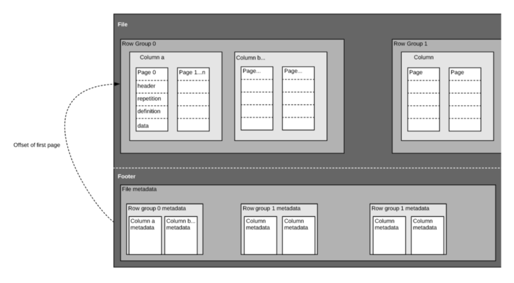

## Learning Objectives

- The difference between column major and row major data
- Speed advantages to columnnar data storage
- Parquet is a highly efficient columnar data store
- Using DuckDB as an in-memory query engine
- How `arrow` enables faster processing

## Introduction

Parallelization is great, and can greatly help you in working with large data. However, it might not help you with every processing problem. Like we talked about with Dask, sometimes your data are too large to be read into memory, or you have I/O limitations. For multidimensional arrary data, `xarray` and `Dask` are pretty amazing. But what about tabular data? Some types of data are not well represented as arrays, and some arrays would not be efficiently represented as tables (see [Abernathy's 2025 article on tensors versus tables](https://earthmover.io/blog/tensors-vs-tables) for a well-thought perspective on this). 

Parquet, DuckDB, and Arrow are powerful tools that are designed to help overcome some of these scaling problems with tabular data. They are newer technologies and are advancing quickly, but there is a lot of excitement about the possibility these tools provide.

::: {.callout-note}
### POSIX file handling

Before jumping into those tools, however, first let's discuss system calls. These are calls that are run by the operating system within their own process. There are several that are relevant to reading and writing data: open, read, write, seek, and close. Open establishes a connection with a file for reading, writing, or both. On open, a file offset points to the beginning of the file. After reading or writing `n` bytes, the offset will move `n` bytes forward to prepare for the next opration. Read will read data from the file into a memory buffer, and write will write data from a memory buffer to a file. Seek is used to change the location of the offset pointer, for either reading or writing purposes. Finally, close closes the connection to the file.

:::

If you've worked with even moderately sized datasets, you may have encounted an "out of memory" error. Memory is where a computer stores the information needed immediately for processes. This is in contrast to storage, which is typically slower to access than memory, but has a much larger capacity. When you `open` a file, you are establishing a connection between your processor and the information in storage. On `read`, the data is read into memory that is then available to your python process, for example.

So what happens if the data you need to read in are larger than your memory? My brand new M1 MacBook Pro has 16 GB of memory, but this would be considered a modestly sized dataset by this courses's standards. There are a number of solutions to this problem, which don't involve just buying a computer with more memory. In this lesson we'll discuss the difference between row major and column major file formats, and how leveraging column major formats can increase memory efficiency. We'll also learn about other python packages like `duckdb` and `pyarrow`, which has a memory format that allows for "zero copy" read.

## Row major vs column major

The difference between row major and column major is in the ordering of items in the data when they are read into memory.

::: {.column-margin}


:::

Take the array:

```
[[11, 12, 13], 
 [21, 22, 23]]
```

In **row-major order**, we would save the order of items in memory with the first row elements in series followed by the second row elements:

`11, 12, 13, 21, 22, 23`

The same data stored in **column-major order** would place elements from the same column close together:

`11, 21, 12, 22, 13, 33`

Because of this difference in ordering of the saved data bytes, accessing the data from e.g., the second column is more efficient if the data are in column-major order. This is because the sequence of bytes storing the values in the second column would be continuous, and could be read without reading any data in columns 1 and 3. But reading many complete rows of data would be inefficient in column-major order, so your expected access patterns will determine which performs better. 

It turns out that, for many analytical purposes, we often only need access to a small subset of data from one or two columns to perform a computation, and so column-major is often efficient.

By default, C and SAS use row major order for arrays, and column major is used by Fortran, MATLAB, R, and Julia.

Python's `numpy` package uses row-major order by default and can be configured to use column-major.

### Row major versus column major files

The same concept can be applied to file formats as the example with in-memory arrays above. In row-major file formats, the values (bytes) of each record are stored sequentially.

Name | Location | Age
-----|----------|----
John | Washington| 40
Mariah | Texas | 21
Allison | Oregon | 57

In the above row major example, data are read in the order:
`John, Washingon, 40\nMariah, Texas, 21\n`.

This means that getting a subset of rows with all the columns would be easy; you can specify to read in only the first X rows (utilizing the seek system call). However, if we are only interested in Name and Location, we would still have to read in all of the rows before discarding the Age column.

If these data were organized in a column major format, they might look like this:

```
Name: John, Mariah, Allison
Location: Washington, Texas, Oregon
Age: 40, 21, 57
```

And the read order would first be the names, then the locations, then the age. This means that selecting all values from a set of columns is quite easy (all of the Names and Ages, or all Names and Locations), but reading in only the first few records from each column would require reading in the entire dataset. Another advantage to column major formats is that compression is more efficient since compression can be done across each column, where the data type is uniform, as opposed to across rows with many data types.

## Parquet

::: {layout-ncol="2"}

Parquet is an open-source binary file format that stores data in a column-major format. The format contains several key components:


:::

- row group
- column
- page
- footer

{.lightbox fig-align="center" width="80%"}

Row groups are blocks of data containin a set number of rows with data from the same columns. Within each row group, data are organized in column-major format, and within each column are pages that are typically a fixed size. The footer of the file contains metadata like the schema, encodings, unique values in each column, etc., which makes scanning metadata very efficient.

The parquet format has many tricks to to increase storage efficiency, and is increasingly being used to handle large datasets.

## Fast access with DuckDB

For the Witharana et al. ice wedge polygon (IWP) dataset ([doi:10.18739/A24F1MK7Q](https://doi.org/10.18739/A24F1MK7Q)), we created a tabular data file of statistics which is 4.6GB in text CSV format, but can be reduced down to 1.6GB by a straight conversion to Parquet:

```
jones@arcticdata.io:iwp_geotiff_low_medium$ du -sh raster_summary.*
4.6G	raster_summary.csv
1.6G	raster_summary.parquet
```

::: {.column-margin}


:::

But even at 1.6GB, that will take a while to download -- how might we know whether we want to? Easy, use [DuckDB](https://duckdb.org/), an in-memory database that can efficiently read and query columnar data formats like Parquet, and much more!

Because DuckDB can access the metadata in a parquet file, and efficiently make use of parquet's efficient data layouts, we can quickly query even a large, remote dataset without downloading the whole thing. First, let's take a look at the columns in the dataset (a metadata-only query):

```{python}
#| eval: false
import duckdb
iwp_path = 'https://arcticdata.io/data/10.18739/A24F1MK7Q/iwp_geotiff_low_medium/raster_summary.parquet'
iwp = duckdb.read_parquet(iwp_path)
print(iwp.columns)
```
```
['stat', 'bounds', 'min', 'max', 'mean', 'median', 'std', 'var', 'sum', 'path', 'tile', 'z']
```

While that dataset is quite large, our metadata query returned in less than a second. Other types of summary queries that can be constructed with just metadata can be exceedingly fast as well. For example, let's count all of the rows, which we can do using SQL syntax:

```{python}
#| eval: false
duckdb.sql("SELECT count(*) as n FROM iwp;").show()
```
```
┌──────────┐
│    n     │
│  int64   │
├──────────┤
│ 18150329 │
└──────────┘
```

So we quickly learn that this table has 18 million rows!

A common operation that can be expensive is to look at the number of distinct values in a column, which, in a row-major data source, would often require reading the entire table. Let's try with DuckDB:

```{python}
#| eval: false
duckdb.sql("select distinct stat from iwp order by stat;").show()
```
```
┌──────────────┐
│     stat     │
│   varchar    │
├──────────────┤
│ iwp_coverage │
└──────────────┘
```

We get an almost immediate return because DuckDB can 1) look only at the `stat` column, ignoring the rest of the data and 2) take advantage of metadata and indexes on those columns, to avoid having to read the whole column anyways.

Finally, let's look at a query of the actual data. If we select just two of the columns, and filter the rows, we can do an ad-hoc query that returns a slice of the massive table very quickly.

```{python}
#| eval: false
low_coverage = iwp.project("bounds, sum").filter("sum < 10")
low_coverage.count('*')
```
```
┌──────────────┐
│ count_star() │
│    int64     │
├──────────────┤
│        37169 │
└──────────────┘
```

And we can easily save our small 1.4 MB slice of the much larger table locally as a parquet file as well using `write_parquet`.

```{python}
#| eval: false
low_coverage.write_parquet("low_coverage.parquet")
os.stat("low_coverage.parquet").st_size / (1024 * 1024)
```
```
1.4038171768188477
```

And last, we can query this new table that we have created:

```{python}
#| eval: false
duckdb.sql("SELECT * from low_coverage order by sum desc").limit(10).show()
```
```
┌──────────────────────────────────────────────────────────────────────────────────┬───────────────────┐
│                                      bounds                                      │        sum        │
│                                     varchar                                      │      double       │
├──────────────────────────────────────────────────────────────────────────────────┼───────────────────┤
│ [116.99340820312375, 117.00439453124875, 71.32324218750009, 71.33422851562509]   │ 9.999709300915525 │
│ [116.99340820312375, 117.00439453124875, 71.32324218750009, 71.33422851562509]   │ 9.999709300915525 │
│ [-77.78320312500044, -77.76123046875044, 81.47460937500003, 81.49658203125003]   │ 9.999367985118123 │
│ [-154.6655273437501, -154.6435546875001, 70.88378906250009, 70.90576171875009]   │ 9.998618022818269 │
│ [-116.36169433593756, -116.35620117187506, 77.39868164062501, 77.40417480468751] │ 9.998248625671277 │
│ [95.05920410156227, 95.06469726562477, 71.65832519531251, 71.66381835937501]     │ 9.997617767005346 │
│ [-100.64575195312506, -100.64025878906256, 78.31054687500001, 78.31604003906251] │ 9.997102780461583 │
│ [123.91479492187477, 123.92028808593727, 73.11950683593751, 73.12500000000001]   │ 9.996871067852531 │
│ [-167.684326171875, -167.6788330078125, 65.73669433593751, 65.74218750000001]    │ 9.995733779230603 │
│ [158.52172851562472, 158.52722167968722, 69.99938964843751, 70.00488281250001]   │ 9.995298698978356 │
├──────────────────────────────────────────────────────────────────────────────────┴───────────────────┤
│ 10 rows                                                                                    2 columns │
└──────────────────────────────────────────────────────────────────────────────────────────────────────┘
```

Amazingly, DuckDB and parquet handle all of this high-performance access without any server-side services running. Typically, remote data access would be provided through a server side service like a postgres database or some other heavyweight process. But in this case, all we have is a file on disk be served up by a standard web server, and all of the querying is done completely client-side, and quickly because of the beauty of the parquet file format.

Of course, you can also download the whole parquet file and access it locally through duckdb as well!

Connecting back to our earlier discussions of parallel processing, one could see how you could drop a large parquet dataset on a server, and then spin up a distributed, parallel processing model where each of the distributed processes use DuckDB to reach out and grab just the small chunk of data it needs to process and compute. Fast, lightweight, and scalable computing, with almost zero infrastructure!

## Arrow

So far, we have discussed the difference between organizing information in row-major and column-major format, how that applies to arrays, and how it applies to data storage on disk using Parquet.

Arrow is a language-agnostic specification that enables representation of column-major information in memory without having to serialize data from disk. The Arrow project provides implementation of this specification in a number of languages, including Python.

Let's say that you have utilized the Parquet data format for more efficient storage of your data on disk. At some point, you'll need to read that data into memory in order to do analysis on it. Arrow enables data transfer between the on disk Parquet files and in-memory Python computations, via the `pyarrow` library.

`pyarrow` is great, but relatively low level. It supports basic group by and aggregate functions, as well as table and dataset joins, but it does not support the full operations that `pandas` does.

## Delta Fisheries using Arrow

In this example, we'll read in a dataset of fish abundance in the San Francisco Estuary, which is published in csv format on the [Environmental Data Initiative](https://portal.edirepository.org/nis/mapbrowse?scope=edi&identifier=1075&revision=1). This dataset isn't huge, but it is big enough (3 GB) that working with it locally can be fairly taxing on memory. Motivated by user difficulties in actually working with the data, the [`deltafish` R](https://github.com/Delta-Stewardship-Council/deltafish) package was written using the R implementation of `arrow`. It works by downloading the EDI repository data, writing it to a local cache in parquet format, and using `arrow` to query it. In this example, I've put the Parquet files in a sharable location so we can explore them using `pyarrow`.

First, we'll load the modules we need.

```{python}
#| eval: false
import pyarrow.dataset as ds
import numpy as np
import pandas as pd
```

Next we can read in the data using `ds.dataset()`, passing it the path to the parquet directory and how the data are partitioned.

```{python}
#| eval: false
deltafish = ds.dataset("/home/shares/deltafish/fish",
                       format="parquet",
                       partitioning='hive')
```

You can check out a file listing using the `files` method. Another great feature of parquet files is that they allow you to partition the data accross variables of the dataset. These partitions mean that, in this case, data from each species of fish is written to it's own file. This allows for even faster operations down the road, since we know that users will commonly need to filter on the species variable. Even though the data are partitioned into different files, `pyarrow` knows that this is a single dataset, and you still work with it by referencing just the directory in which all of the partitioned files live.

```{python}
#| eval: false
deltafish.files
```

```
['/home/shares/deltafish/fish/Taxa=Acanthogobius flavimanus/part-0.parquet',
 '/home/shares/deltafish/fish/Taxa=Acipenser medirostris/part-0.parquet',
 '/home/shares/deltafish/fish/Taxa=Acipenser transmontanus/part-0.parquet',
 '/home/shares/deltafish/fish/Taxa=Acipenser/part-0.parquet'...]
 ```

 You can view the columns of a dataset using `schema.to_string()`

```{python}
#| eval: false
deltafish.schema
```

```
SampleID: string
Length: double
Count: double
Notes_catch: string
Species: string
```

If we are only interested in a few species, we can do a filter:

```{python}
#| eval: false
expr = ((ds.field("Taxa")=="Dorosoma petenense")| 
        (ds.field("Taxa")=="Morone saxatilis") |
        (ds.field("Taxa")== "Spirinchus thaleichthys"))

fishf = deltafish.to_table(filter = expr,
                           columns =['SampleID', 'Length', 'Count', 'Taxa'])
```


There is another dataset included, the survey information. To do a join, we can just use the `join` method on the `arrow` dataset.

First read in the survey dataset.

```{python}
#| eval: false
survey = ds.dataset("/home/shares/deltafish/survey",
                    format="parquet",
                    partitioning='hive')
```

Take a look at the columns again:

```{python}
#| eval: false
survey.schema
```

Let's pick out only the ones we are interested in.

```{python}
#| eval: false
survey_s = survey.to_table(columns=['SampleID','Datetime', 'Station', 'Longitude', 'Latitude'])
```


Then do the join, and convert to a pandas `data.frame`. 

```{python}
#| eval: false
fish_j = fishf.join(survey_s, "SampleID").to_pandas()
fish_j.head()
```

Note that when we did our first manipulation of this dataset, we went from working with a `FileSystemDataset`, which is a representation of a dataset on disk without reading it into memory, to a `Table`, which is read into memory. `pyarrow` has a [number of functions](https://arrow.apache.org/docs/python/compute.html) that do computations on datasets without reading them into memory. However these are evaluated "eagerly," as opposed to "lazily." These are useful in some cases, like above, where we want to take a larger than memory dataset and generate a smaller dataset (via filter, or group by/summarize), but are not as useful if we need to do a join before our summarization/filter.

More functionality for lazy evaluation is on the horizon for `pyarrow` though, by leveraging [Ibis](https://ibis-project.org/docs/3.0.2/tutorial/01-Introduction-to-Ibis/).

## Parquet Performance hints

While the specifics of your data structures, organization, and access patterns will ultimately drive the best approach to representing tabular data, a few good practices have emerged that may help you. But even without these, just moving from text formats like CSV to the open binary format of parquet may net you some huge gains. A few things you might consider:

- Avoid Lots of Small Files

A lot of small files generally means a lot of metadata handling, and a lot of read and write operations that can add up. Modern filesystems can handle directories with millions of file entries, but that doesn't mean it is convenient to use them that way. While at times there are good reasons to break a file into multiple partitioned files, accumulating too many small files can bog down your system. For larger datasets, individual files of up to a Gigabyte will generally work well.

- Partition your Data

Partitioning your data into multiple parquet files, each containing one cluster of the data, can really speed things up when people only need to access a few of those partitions. If your partitioning scheme matches your data aceess patterns, then you can significantly lower the amount of data people need to access to get at what they want. A good rule of thumb is to create partitions that correspond to your access filters if there aren't too many values for that variable. For example, if people query by month, then a partition over month will allow access to just the subset of data that meets particular filter queries.

- Tune Row Groups

Row groups contain pages of column data and are the main storage area for parquet. By picking a good row group size, you can optimize your performance. Larger row groups will result in fewer I/O operations to read each chunk of column data, which means reads will likely be faster. But those reads will be larger, and so will require more memory. Also, if you want to do fine-grained parallel processing, it is helpful if the size of the row groups and chunks corresponds to the size of your processing jobs -- you don't want workers reading more data than needed because it is reading in a big row group. Row group size and your paritioning scheme work hand in hand to optimize the size of data chunks that are accessed.

## Synopsis

In this lesson we focused on:

- the difference between row major and column major formats
- under what circumstances a column major data format can improve memory efficiency
- how to use DuckDB and Arrow interact with Parquet files to scalably analyze data