## Learning Objectives

- Understand the basic architecture of computer networks
- Learn how to connect to a remote computer via a shell
- Become familiarized with Bash Shell programming to navigate your computer's file system, manipulate files and directories, and automate processes
- Learn different uses of the term *cloud computing*
- Understand the services of cloud providers
- Gain familiarity with containerized computing

## Introduction

Scientific synthesis and our ability to effectively and efficiently work with big data depends on the use of computers and the internet. Working on a personal computer may be sufficient for many tasks, but as data get larger and analyses more computationally intensive, scientists often find themselves needing more computing resources than they have available locally. Remote computing, or the process of connecting to a computer(s) in another location via a network link is becoming more and more common in overcoming big data challenges.

In this lesson, we'll learn about the architecture of computer networks and explore some of the different remote computing configurations that you may encounter, we'll learn how to securely connect to a remote computer via a shell, and we'll become familiarized with using Bash Shell to efficiently manipulate files and directories. We will begin working in the [VS Code](https://code.visualstudio.com/) IDE (integrated development environment), which is a versatile code editor that supports many different languages.

## Servers & Networking

Remote computing typically involves communication between two or more "host" computers. Host computers connect via networking equipment and can send messages to each other over communication protocols (aka an [Internet Protocol](https://en.wikipedia.org/wiki/Internet_Protocol), or IP). Host computers can take the role of **client** or **server**, where servers share their resources with the client. Importantly,  these client and server roles are not inherent properties of a host (i.e. the same machine can play either role). 

- **Client**: the host computer *intiating* a request
- **Server**: the host computer *responding* to a request

<center>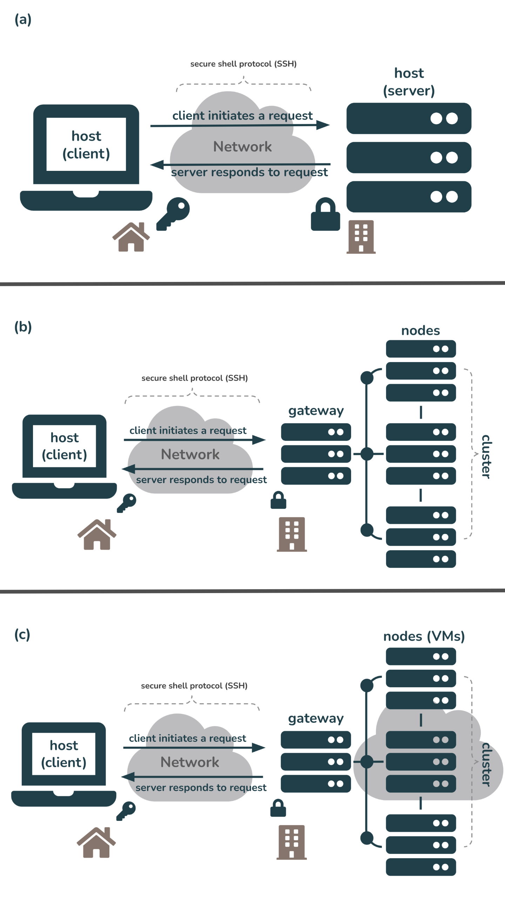</center>


<span style = 'font-size: 85%; color: #6e6d6d;'>**Fig 1.** Examples of different remote computing configurations. (a) A client uses secure shell protocol (SSH) to login/connect to a server over the internet. (b) A client uses SSH to login/connect to a computing cluster (i.e. a set of computers (nodes) that work together so that they can be viewed as a single system) over the internet. In this example, servers A - I are each nodes on this single cluster. The connection is first made through a gateway node (i.e. a computer that routes traffic from one network to another). (c) A client uses SSH to login/connect to a computing cluser where each node is a virtual machine (VM). In this example, the cluster comprises three servers (A, B, and C). VM1 (i.e. node 1) runs on server A while VM4 runs on server B, etc. The connection is first made through a gateway node.</span>

## IP addressing

Hosts are assigned a **unique numerical address** used for all communication and routing called an [Internet Protocol Address (IP Address)](https://en.wikipedia.org/wiki/IP_address). They look something like this: **128.111.220.7**. Each IP Address can be used to communicate over various "[ports](https://en.wikipedia.org/wiki/Port_(computer_networking))", which allow multiple applications to communicate with a host without mixing up traffic. 

::: {.callout-note}
## Port numbers are divided into three ranges: 

1.  *well-known ports*, range from 0 through 1023 and are reserved for the most commonly used services (see table below for examples of some well-known port numbers)
2.   *registered ports*, range from 1024 through 49151 and are not assigned or controlled, but can be registered (e.g. by a vendor for use with thier own server application) to prevent duplication
3.   *dynamic ports*, range from 49152 through 65535 and are not assigned, controlled, or registered but may instead be used as temporary or private ports

| well-known port  | assignment                                                                    |
|------------------|-------------------------------------------------------------------------------|
|      20, 21      | File Transfer Protocol (FTP), for transfering files between a client & server |   
|        22        | secure shell (SSH), to create secure network connections                       | 
|        53        | Domain Name System (DNS) service, to match domain names to IP addresses       |
|        80        | Hypertext Transfer Protocol (HTTP), used in the World Wide Web                |
|       443        | HTTP Secure (HTTPS), an encrypted version of HTTP                             |
:::

Because IP addresses can be difficult to remember, they are also assigned **hostnames**, which are handled through the global [Domain Name System (DNS)](https://en.wikipedia.org/wiki/Domain_Name_System). Clients first look up a hostname in the DNS to find the IP address, then open a connection to the IP address.
    
::: {.callout-note} 
## In order to connect to remote servers, computing clusters, virtual machines, etc., you need to know their IP address (or hostname)
A couple important ones:  

1. Throughout this course, we'll be working on a server with the hostname, **included-crab** and IP address, 128.111.85.28 (in just a little bit, we'll learn how to connect to **included-crab** using SSH)  
2. **localhost** is a hostname that refers to your local computer and is assigned the IP address 127.0.0.1 -- the concept of localhost is important for tasks such as website testing, and is also important to understand when provisioning local execution resources (e.g. we'll practice this during the [section 6 exercise](https://github.com/NCEAS/scalable-computing-examples/blob/main/group-project/solutions/session-06-solution.ipynb) when working with `Parsl`.)
:::

## Bash Shell Programming

*What is a shell?* From [Wikipedia](https://en.wikipedia.org/wiki/Shell_(computing)): 

> "a computer program which exposes an operating system's services to a human user or other programs. In general, operating system shells use either a command-line interface (CLI) or graphical user interface (GUI), depending on a computer's role and particular operation."

<center></center>

*What is Bash?* Bash, or **B**ourne-**a**gain **Sh**ell, is a command line tool (language) commonly used to manipulate files and directories. Accessing and using bash is slightly different depending on what type of machine you work on:

- **Mac:** bash via the [Terminal](https://support.apple.com/guide/terminal/welcome/mac), which comes ready-to-use with all Macs and Linux machines

- **Windows:** running bash depends on which version of Windows you have -- newer versions may ship with bash or may require a separate install (e.g. [Windows Subsystem for Linux (WSL)](https://docs.microsoft.com/en-us/windows/wsl/about) or [Git Bash](https://gitforwindows.org/)), however there are a number of different (non-bash) shell options as well (they all vary slightly; e.g. [PowerShell](https://docs.microsoft.com/en-us/powershell/), [Command Prompt](https://en.wikipedia.org/wiki/Cmd.exe)).

::: {.callout-note}
Mac users may have to switch from [Z Shell](https://www.zsh.org/), or zsh, to bash. Use the command `exec bash` to switch your default shell to bash (or `exec zsh` to switch back).
:::

### Some commonly used (and very helpful) shell commands:

Below are just a few shell commands that you're likely to use. Some may be extended with options (more on that in the next section) or even piped together (i.e. where the output of one command gets sent to the next command, using the `|` operator). You can also find some nice bash cheat sheets online, like [this one](https://github.com/RehanSaeed/Bash-Cheat-Sheet). Alternatively, the [Bash Reference Manual](https://www.gnu.org/savannah-checkouts/gnu/bash/manual/bash.html) has *all* the content you need, albeit a bit dense.

| bash command     | what it does                                                                  |
|------------------|-------------------------------------------------------------------------------|
|      `pwd`       | print your current working directory                                          | 
|      `cd`        | change directory                                                              |
|      `ls`        | list contents of a directory                                                  |
|      `tree`      | display the contents of a directory in the form of a tree structure (not installed by default) |
|      `echo`      | print text that is passed in as an argument                                   |
|      `mv`        | move or rename a file                                                         |
|      `cp`        | copy a file(s) or directory(ies)                                              |
|      `touch`     | create a new empty file                                                       |
|      `mkdir`     | create a new directory                                                        |
|      `rm`/`rmdir`| remove a file/ empty directory (be careful -- there is no "trash" folder!)    | 
|      `grep`      | searches a given file(s) for lines containing a match to a given pattern list |
|      `awk`       | a text processing language that can be used in shell scripts or at a shell prompt for actions like pattern matching, printing specified fields, etc. |
|      `sed`       | stands for **S**tream **Ed**itor; a versatile command for editing files       |
|      `cut`       | extract a specific portion of text in a file                                  |
|      `join`      | join two files based on a key field present in both                           |
|   `top`, `htop`  | view running processes in a Linux system  (press `Q` to quit)                 |

### General command syntax

Bash commands are typically are written as: `command [options] [arguments]` where the command must be an executable on your PATH and where [options](https://tldp.org/LDP/abs/html/options.html) (settings that change the shell and/or script behavior) take one of two forms: **short form** (e.g. `command -option-abbrev`) or **long form** (e.g. `command --option-name` or `command -o option-name`). An example:

```{.bash}
# the `ls` command lists the files in a directory
ls file/path/to/directory

# adding on the `-a` or `--all` option lists all files (including hidden files) in a directory
ls -a file/path/to/directory # short form
ls --all file/path/to/directory # long form
ls -o all file/path/to/directory # long form
```

### Some useful keyboard shortcuts

It can sometimes feel messy working on the command line. These keyboard shortcuts can make it a little easier: 

-  `Ctrl` + `L`: clear your terminal window
-  `Ctrl` + `U`: delete the current line
-  `Ctrl` + `C`: abort a command
- up & down arrow keys: recall previously executed commands in chronological order
- TAB key: autocompletion

## Connecting to a remote computer via a shell

In addition to navigating your computer/manipulating your files, you can also use a shell to gain accesss to and remotely control other computers. To do so, you'll need the following:

- a remote computer (e.g. server) which is turned on
- client and server ssh clients installed/enabled 
- the IP address or name of the remote computer
- the necessary permissions to access the remote computer

Secure Shell, or SSH, is a network communication protocol that is often used for securely connecting to and running shell commands on a remote host, tremendously simplifying remote computing. 

## Git via a shell

[Git](https://git-scm.com/), a popular version control system and command line tool can be accessed via a shell. While there are lots of graphical user interfaces (GUIs) that faciliatate version control with Git, they often only implement a small subset of Git's most-used functionality. By interacting with Git via the command line, you have access to *all* Git commands. While all-things Git is outside the scope of this workshop, we will use some basic Git commands in the shell to clone GitHub (remote) repositories to the server and save/store our changes to files. A few important Git commands:

| Git command     | what it does                                                                  |
|-----------------|-------------------------------------------------------------------------------|
|    `git clone`  | create a copy (clone) of repository in a new directory in a different location| 
|    `git add`    | add a change in the working directory to the staging area                     |
|    `git commit` | record a snapshot of a repository; the `-m` option adds a commit message      |
|    `git push`   | send commits from a local repository to a remote repository                   |
|    `git fetch`  | downloads contents (e.g. files, commits, refs) from a remote repo to a local repo |
|    `git pull`   | fetches contents of a remote repo and merges changes into the local repo     |

## Let's practice!

We'll now use bash commands to do the following: 

- connect to the server (**included-crab**) that we'll be working on for the remainder of this course
- navigate through directories on the server and add/change/manipulate files
- clone a GitHub repository to the server
- automate some of the above processes by writing a bash script

### **Exercise 1:** Connect to a server using the `ssh` command (or using VS Code's command palette)

Let's connect to a remote computer (**included-crab**) and practice using some of above commands. 

1. Launch a terminal in VS Code

- There are two options to open a terminal window, if a terminal isn't already an open pane at the bottom of VS Code 

    a) Click on `Terminal > New Terminal` in top menu bar

    b) Click on the `+ (dropdown menu) > bash` in the bottom right corner

::: {.callout-note}
You don't *need* to use the VS Code terminal to ssh into a remote computer, but it's conveniently located in the same window as your code when working in the VS Code IDE.
:::

2.  Connect to a remote server 

- You can choose to SSH into the server (included-crab.nceas.ucsb.edu) through **(a)**  the command line by using the `ssh` command, or **(b)** through VS Code's command palette. If you prefer the latter, please refer back to the [**Log in to the server** section](https://learning.nceas.ucsb.edu/2022-09-arctic/#log-in-to-the-server). To do so via the command line, use the `ssh` command followed by `yourusername@included-crab.nceas.ucsb.edu`. You'll be prompted to type/paste your password to complete the login. It should look something like this:

```{.bash}
yourusername:~$ ssh yourusername@included-crab.nceas.ucsb.edu 
yourusername@included-crab.nceas.ucsb.edu's password: 
yourusername@included-crab:~$ 
```

::: {.callout-important}
You won't see anything appear as you type or paste your password -- this is a security feature! Type or paste your password and press enter/return when done to finish connecting to the server.
:::

::: {.callout-note}
To log out of the server, type `exit` -- it should look something like this:

```{.bash}
yourusername@included-crab.nceas.ucsb.edu:$ exit
logout
Connection to included-crab.nceas.ucsb.edu closed.
(base) .....
```
:::

### **Exercise 2:** Practice using some common bash commands

1. Use the `pwd` command to print your current location, or working directory. You should be in your home directory on the server (e.g. `/home/yourusername`).

2. Use the `ls` command to list the contents (any files or subdirectories) of your home directory 

3. Use the `mkdir` command to create a new directory named `bash_practice`:

```{.bash}
mkdir bash_practice
```

4. Use the `cd` command to move into your new `bash_practice` directory:

```{.bash}
# move from /home/yourusername to home/yourusername/bash_practice
cd bash_practice
```

- To move *up* a directory level, use two dots, `..` : 

```{.bash}
# move from /home/yourusername/bash_practice back to /home/yourusername
$ cd ..
```

:::{.callout-note}
To quickly navigate back to your home directory from wherever you may be on your computer, use a tilde, `~` :

```{.bash}
# e.g. to move from from some subdirectory, /home/yourusername/Projects/project1/data, back to your home directory, home/yourusername
$ cd ~

# or use .. to back out three subdirectories
$ cd ../../..
```
:::

5. Add some `.txt` files (`file1.txt`, `file2.txt`, `file3.txt`) to your `bash_practice` subdirectory using the `touch` command (**Note:** be sure to `cd` into `bash_practice` if you're not already there):

```{.bash}
# add one file at a time
touch file1.txt
touch file2.txt
touch file3.txt

# or add all files simultanously like this:
touch file{1..3}.txt

# or like this:
touch file1.txt file2.txt file3.txt
```

6. You can also add other file types (e.g. `.py`, `.csv`, etc.)

```{.bash}
touch mypython.py mycsv.csv
```

7. Print out all the `.txt` files in `bash_practice` using a wildcard, `*`:

```{.bash}
ls *.txt
```

8. Count the number of `.txt` files in `bash_practice` by combining the `ls` and `wc` (word count) funtions using the pipe, `|`, operator:

```{.bash}
# `wc` returns a word count (lines, words, chrs)
# the `-l` option only returns the number of lines
# use a pipe, `|`, to send the output from `ls *.txt` to `wc -l`
ls *.txt | wc -l
```

9. Delete `mypython.py` using the `rm` command:

```{.bash}
rm mypython.py 
```

10. Create a new directory inside `bash_practice` called `data` and move `mycsv.csv` into it. 

```{.bash}
mkdir data
mv mycsv.csv ~/bash_practice/data

# add the --interactive option (-i for short) to prevent a file from being overwritten by accident (e.g. in case there's a file with the same name in the destination location)
mv -i mycsv.csv ~/bash_practice/data
```

11. Use `mv` to rename `mycsv.csv` to `mydata.csv`

```{.bash}
mv mycsv.csv mydata.csv
```

12. Add column headers `col1`, `col2`, `col3` to `mydata.csv` using `echo` + the `>` operator

```{.bash}
echo "col1, col2, col3" > mydata.csv
```

:::{.callout-tip}
You can check to see that `mydata.csv` was updated using [GNU nano](https://www.nano-editor.org/), a text editor for the command line that comes preinstalled on Linux machines (you can edit your file in nano as well). To do so, use the `nano` command followed by the file you want to open/edit:

```{.bash}
nano mydata.csv
```

To save and quit out of nano, use the `control` + `X` keyboard shortcut. 

You can also create and open a file in nano in just one line of code. For example, running `nano hello_world.sh` is the same as creating the file first using `touch hello_world.sh`, then opening it with nano using `nano hello_world.sh`.
:::

13. Append a row of data to `mydata.csv` using `echo` + the `>>` operator

```{.bash}
# using `>` will overwrite the contents of an existing file; `>>` appends new information to an existing file
echo "1, 2, 3" >> mydata.csv
```

### **Exercise 3:** Clone a GitHub repository to the server

IDEs commonly have helper buttons for cloning (i.e. creating a copy of) remote repositories to your local computer (or in this case, a server), but using git commands in a terminal can be just as easy. We can practice that now, following the steps below: 

1. Go to the **`scalable-computing-examples`** repository on GitHub at <https://github.com/NCEAS/scalable-computing-examples> -- this repo contains example files for you to edit and practice in throughout this course. Fork (make your own copy of the repository) this repo by clicking on the **Fork** button (top right corner of the repository's page).

<center></center>

<br>

2. Once forked, click on the green **Code** button (from the *forked* version of the GitHub repo) and copy the URL to your clipboard.

<center>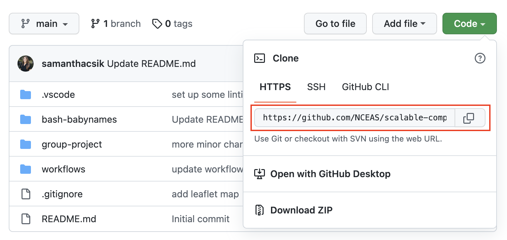</center>

<br>

3. In the VS Code terminal, use the `git clone` command to create a copy of the `scalable-computing-examples` repository in the top level of your user directory (i.e. your home directory) on the server (**Note:** use `pwd` to check where you are; use `cd ~/` to navigate back to your home directory if you find that you're somewhere else). 

```{.bash}
git clone <url-of-forked-repo>
```
4. You should now have a copy of the `scalable-computing-examples` repository to work on on the server. Use the `tree` command to see the structure of the repo (you need to be in the `scalable-computing-examples` directory for this to work) -- there should be a subdirectory called `02-bash-babynames` that contains (i) a `README.MD` file, (ii) a `KEY.sh` file (this is a functioning bash script available for reference; we'll be recreating it together in the next exercise) and (iii) a `namesbystate` folder containing 51 `.TXT` files and a `StateReadMe.pdf` file with some metadata. 

### **Bonus Exercise:** Automate data processing with a Bash script

As we just demonstrated, we can use bash commands in the terminal to accomplish a variety of tasks like navigating our computer's directories, manipulating/creating/adding files, and much more. However, writing a bash *script* allows us to gather and save our code for automated execusion. 

We just cloned the `scalable-computing-examples` GitHub repository to the server in [**Exercise 3**](https://learning.nceas.ucsb.edu/2022-09-arctic/sections/02-remote-computing.html#exercise-3-clone-a-github-repository-to-the-server) above. This contains a `02-bash-babynames` folder with 51 `.TXT` files (one for each of the 50 US states + The District of Columbia), each with the top 1000 most popular baby names in that state. We're going to use some of the bash commands we learned in [**Exercise 2**](https://learning.nceas.ucsb.edu/2022-09-arctic/sections/02-remote-computing.html#exercise-2-practice-using-some-common-bash-commands) to concatenate all rows of data from these 51 files into a single `babynames_allstates.csv` file.

Let's begin by creating a simple bash script that when executed, will print out the message, "Hello, World!" This simple script will help us determine whether or not things are working as expected before writing some more complex (and interesting) code. 

1. Open a terminal window and determine where you are by using the `pwd` command -- we want to be in `scalable-computing-examples/02-bash-babynames`. If necessary, navigate here using the `cd` command. 

2. Next, we'll create a shell script called `mybash.sh` using the `touch` command:

```{.bash}
$ touch mybash.sh
```

3. There are a number of ways to edit a file or script -- we'll use [Nano](https://www.nano-editor.org/), a terminal-based text editor, as we did earlier. Open your `mybash.sh` with nano by running the following in your terminal:

```{.bash}
$ nano mybash.sh
```
4. We can now start to write our script. Some important considerations:

- Anything following a `#` will not be executed as code -- these are useful for adding comments to your scripts
- The first line of a Bash script starts with a **shebang**, `#!`, followed by a path to the Bash interpreter -- this is used to tell the operating system which interpreter to use to parse the rest of the file. There are two ways to use the shebang to set your interpreter (read up on the pros & cons of both methods on this [Stack Overflow post](https://stackoverflow.com/questions/10376206/what-is-the-preferred-bash-shebang)):

```{.bash}
# (option a): use the absolute path to the bash binary
#!/bin/bash

# (option b): use the env untility to search for the bash executable in the user's $PATH environmental variable
#!/usr/bin/env bash
```

5. We'll first specify our bash interpreter using the shebang, which indicates the start of our script. Then, we'll use the `echo` command, which when executed, will print whatever text is passed as an argument. Type the following into your script (which should be opened with nano), then save (Use the keyboard shortcut `control` + `X` to exit, then type `Y` when it asks if you'd like to save your work. Press `enter/return` to exit nano).

```{.bash}
# specify bash as the interpreter
#!/bin/bash

# print "Hello, World!"
echo "Hello, World!"
```

6. To execute your script, use the `bash` command followed by the name of your bash script (be sure that you're in the same working directory as your `mybash.sh` file or specify the file path to it). If successful, "Hello, World!" should be printed in your terminal window.

```{.bash}
bash mybash.sh
```

7. Now let's write our script. Re-open your script in nano by running `nano mybash.sh`. Using what we practiced above and the hints below, write a bash script that does the following:

- prints the number of `.TXT` files in the `namesbystate` subdirectory
- prints the first 10 rows of data from the `CA.TXT` file (HINT: use the `head` command)
- prints the last 10 rows of data from the `CA.TXT` file (HINT: use the `tail` command)
- creates an empty `babynames_allstates.csv` file in the `namesbystate` subdirectory (this is where the concatenated data will be saved to)
- adds the column names, `state`, `gender`, `year`, `firstname`, `count`, in that order, to the `babynames_allstates.csv` file
- concatenates data from all `.TXT` files in the `namesbystate` subdirectory and appends those data to the `babynames_allstates.csv` file (HINT: use the `cat` command to concatenate files)

Here's a script outline to fill in (**Note:** The `echo` statements below are not necessary but can be included as progress indicators for when the bash script is executed -- these also make it easier to diagnose where any errors occur during execution):

```{.bash}
#!bin/bash
echo "THIS IS THE START OF MY SCRIPT!"

echo "-----Verify that we have .TXT files for all 50 states + DC-----"
# <add your code here>

echo "-----Printing head of CA.TXT-----"
# <add your code here>

echo "-----Printing tail of CA.TXT-----"
# <add your code here>

echo "-----Creating empty .csv file to concatenate all data-----"
# <add your code here>

echo "-----Adding column headers to csv file-----"
# <add your code here>

echo "-----Concatenating files-----"
# <add your code here>

echo "DONE!"
```

:::{.callout-tip collapse="true"}
### Answer
```{.bash}
#!bin/bash
echo "THIS IS THE START OF MY SCRIPT!"

echo "-----Verify that we have .TXT files for all 50 states + DC-----"
ls namesbystate/*.TXT | wc -l

echo "-----Printing head of CA.TXT-----"
head namesbystate/CA.TXT

echo "-----Printing tail of CA.TXT-----"
tail namesbystate/CA.TXT

echo "-----Creating empty .csv file to concatenate all data-----"
touch namesbystate/babynames_allstates.csv

echo "-----Adding column headers to csv file-----"
echo "state, gender, year, firstname, count" > namesbystate/babynames_allstates.csv

echo "-----Concatenating files-----"
cat namesbystate/*.TXT >> namesbystate/babynames_allstates.csv

echo "DONE!"
```
:::

## Monitoring performance

When working on a remote server, it's important to be mindful of the resources that your processes are using. If you run a computationally intensive process, it can slow down the server for other users who are also using the server's resources. To monitor the performance of your processes and the server, you can use commands like `htop` or `glances`, which show you how much CPU and memory is being used by each process on the server. This can help you identify if your processes are using too many resources and adjust accordingly (e.g. by using `nice` to lower the priority of your processes).

The simplest approach is to look at the processes that are currently running on the server and how much CPU and memory they are using. The `ps` command lists the processes that are currently running on the server, along with their process ID (PID), CPU usage, memory usage, and other information. You can use the `ps` command with various options to filter and sort the output to find the processes that are using the most resources. For example, you can use `ps` to simply see which processes are running in your current terminal session:

```{bash}
jones@aurora:~$ ps
    PID TTY          TIME CMD
1683944 pts/23   00:00:00 bash
1985726 pts/23   00:00:00 ps
```

That only shows the processes that are running in the current terminal session. To see all processes running on the server, you can use the `-U` option to see all processes for a specific user, or you can use the `-e` option to see all processes running on the server regardless of user. For example, `ps -U jones` will show all processes running on the server that are owned by the user "jones", while `ps -e` will show all processes running on the server regardless of user.

Each process can also spawn child processes, which can also use resources. To see the parent-child relationships between processes, you can use the `--forest` option with the `ps` command. For example, `ps -U jones --forest` will show all processes owned by the user "jones" in a tree-like format that indicates which processes are parents and which are children.

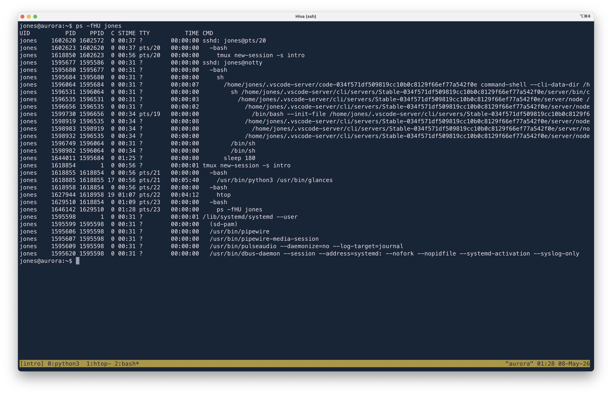

To get a more dynamic view of the processes running on the server and their resource usage, you can use the `htop` command, which provides an interactive interface for monitoring processes. When you run `htop`, you'll see a list of processes sorted by CPU usage, along with information about their memory usage, CPU usage, and other details. You can use the arrow keys to navigate through the list of processes and see more information about each process. You can also use the `F6` key to sort the processes by different criteria (e.g. memory usage, CPU time, etc.) and the `F4` key to filter the processes by different criteria, such as searching for your script names.

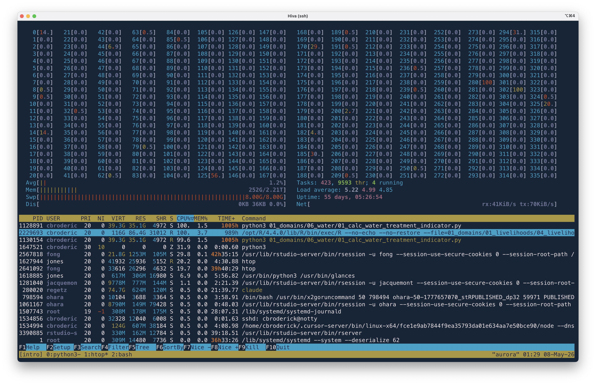

An alternative to `htop` is `glances`, which provides a more comprehensive view of the server's performance, including CPU usage, memory usage, disk I/O, network activity, and more. When you run `glances`, you'll see a dashboard that shows you the current state of the server's resources, along with a list of processes sorted by CPU usage. You can use the arrow keys to navigate through the list of processes and see more information about each process.

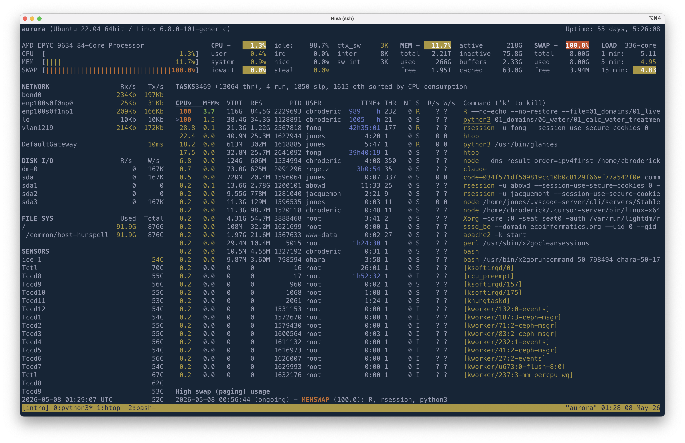

When looking for performance issues, it's important to keep in mind that the processes that are using the most CPU or memory may not necessarily be the ones that are causing the performance issues. For example, a process that is using a lot of CPU may be doing so because it's waiting for input or output, rather than because it's actually doing a lot of work. Similarly, a process that is using a lot of memory may be doing so because it's caching data, rather than because it's actually using a lot of memory. Therefore, it's important to look at the overall performance of the server and consider other factors (e.g. disk I/O, network activity, etc.) when diagnosing performance issues. At any given point in time, your process performance will always be limited by one of the major resources (CPU, memory, disk I/O, network activity), so it's important to look at all of these factors when diagnosing performance issues.

::: {center}

```{mermaid}
flowchart TB
    CPU([CPU usage])
    MEM[/Memory usage/]
    DISK[(Disk I/O)]
    NET{{Network activity}}

    CPU --> MEM
    CPU --> DISK
    CPU --> NET

    classDef perf fill:#e8f3ff,stroke:#2f6aa3,stroke-width:1.5px,color:#123b5f;
    class CPU,MEM,DISK,NET perf;
```

:::

## Shell tips and tricks

### Being nice  

When working on a shared server, it's important to be considerate of other users who may also be using the server's resources. Here are some tips for being a good citizen when working on a shared server:

- Check the server's resource usage before running a computationally intensive task. You can use commands like `htop` or `glances`to see how much CPU and memory is being used by other processes on the server
- Use `nice` to run your processes with a lower priority, which can help prevent your processes from hogging resources and slowing down the server for other users. For example, you can run a command with `nice` like this: `nice -n 10 my_command`, where `-n 10` sets the priority level to 10 (the default is 0, and higher numbers indicate lower priority)

## Terminating a process 

When you run any command in the terminal, it starts a process. If you run a command that takes a long time to execute, you may want to stop it before it finishes. You can do this by using the `Ctrl` + `C` keyboard shortcut, which sends a "SIGINT" signal to the process, telling it to stop.

```bash
jones@aurora:~$ truncate -s 50G huge_sparse.bin
jones@aurora:~$ du -sh huge_sparse.bin
50G     huge_sparse.bin
jones@aurora:~$ cat huge_sparse.bin | sha256sum
^C
```

However, if your process is running in the background (e.g. you used the `&` operator to run it in the background), or if it was started as a child of another process, it may not respond to the `Ctrl` + `C` signal. In that case, you can use the `kill` command to send a different signal to the process, such as "SIGTERM" or "SIGKILL", which will force it to stop. To do so, you need to know the process ID (PID) of the process, which you can find using the `ps` command. Once you have the PID, you can use the `kill` command followed by the PID to send a signal to the process. For example, `kill 12345` will send a SIGTERM signal to the process with PID 12345, while `kill -9 12345` will send a SIGKILL signal to the same process.

```bash
jones@aurora:~$ cat huge_sparse.bin | sha256sum &
[1] 1791975
jones@aurora:~$ jobs
[1]+  Running                 cat huge_sparse.bin | sha256sum &
jones@aurora:~$ ps
    PID TTY          TIME CMD
1683944 pts/23   00:00:00 bash
1791974 pts/23   00:00:04 cat
1791975 pts/23   00:00:26 sha256sum
1792411 pts/23   00:00:00 ps
jones@aurora:~$ kill 1791975
jones@aurora:~$ ps
    PID TTY          TIME CMD
1683944 pts/23   00:00:00 bash
1793165 pts/23   00:00:00 ps
[1]+  Terminated              cat huge_sparse.bin | sha256sum
jones@aurora:~$
```

Finally, if you launch one or more processes on a remote server and then disconnect from the server, those processes will be terminated. This is because when you disconnect, the server sends a "hangup" signal `SIGHUP` to all processes that were initiated from your session, which causes them to stop running.

### Don't hangup  

When working on a remote server, it's important to be aware that your connection may be interrupted for various reasons (e.g. network issues, server maintenance, etc.), or maybe you just exit your terminal. When you do, the processes you were running will also be terminated. Here are some tips for being persistent when working on a remote server.

- If you're running a long-running process, consider using `nohup` to run it in the background, which allows you to disconnect from the server without interrupting the process. For example: 
- `nohup my_command &`

What that does is to run the program `my_command` in the background (the `&` operator indicates to put it in the background) and to ignore the hangup signal (the `nohup` command), which allows the process to continue running even if your connection to the server is interrupted. The output of the command will be saved to a file called `nohup.out` in the current directory. 

Alternatively, you can redirect the output to a specific file like this:
- `nohup my_command > output.log 2>&1 &`

That redirects the standard output (stdout) to `output.log` and the standard error (stderr) to the same file (`2>&1` means "redirect stderr to the same location as stdout"). This way, you can keep track of both the normal output and any error messages generated by `my_command` in a single log file. 

Here's a concrete example of how to use `nohup` to run a long-running process in the background:

```bash
jones@aurora:~$ nohup cat huge_sparse.bin | sha256sum > output.log 2>&1 &
[1] 1802035
jones@aurora:~$ ps
    PID TTY          TIME CMD
1683944 pts/23   00:00:00 bash
1802034 pts/23   00:00:00 cat
1802035 pts/23   00:00:03 sha256sum
1802140 pts/23   00:00:00 ps
jones@aurora:~$ kill 1802035
jones@aurora:~$
```

You might instead choose to redirect stdout and stderr to separate files for easier debugging, like this:
- `nohup my_command > output.log 2> error.log &`

### Persistent sessions with tmux  

If you run models and simulations, or even dat awrangling jobs that take a long time to run, you may want to be able to let those processes run without having to keep your terminal open the whole time, and to be able to check in on the progress of your processes from work, home, and on the road. `tmux` is a workhorse tool that allows you to create multiple terminal sessions within a single terminal window, and to detach and reattach to those sessions as needed. This means that you can start a process in a `tmux` session, detach from the session, and then reattach later to check on the progress of the process or to interact with it. The process will continue to run in the background even if you disconnect from the server or close your terminal window.

`tmux` is a deep lake to explore, but here we'll cover some of the basics to get you started. Here's a nice [tutorial](https://www.hamvocke.com/blog/a-guide-to-getting-started-with-tmux/) to fill in a few of the gaps, and there are a lot more of those out there if you want to dive deeper.


To start a new `tmux` session, simply run the `tmux` command in your terminal:

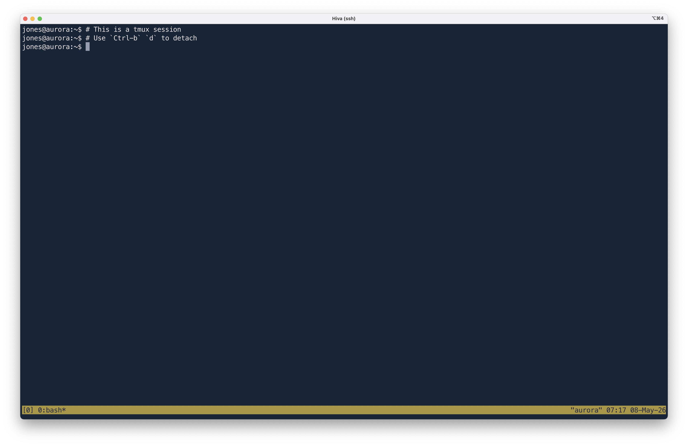

That creates a new `tmux` session and opens a new terminal window within that session. You can then run any commands you want within that terminal window, and they will continue to run even if you detach from the session or disconnect from the server. When you `exit` the shell within the `tmux` session, it will end the session and all processes running within it. 

```bash
jones@aurora:~$ tmux
[exited]
```

Let's start a new session, but this time give it a name. We'll call it "monitor" since we'll be using it to monitor the progress of a long-running process. To do that, use `tmux new -s monitor` with the name of the session when you start `tmux`, and then launch `htop` in the tmux session.

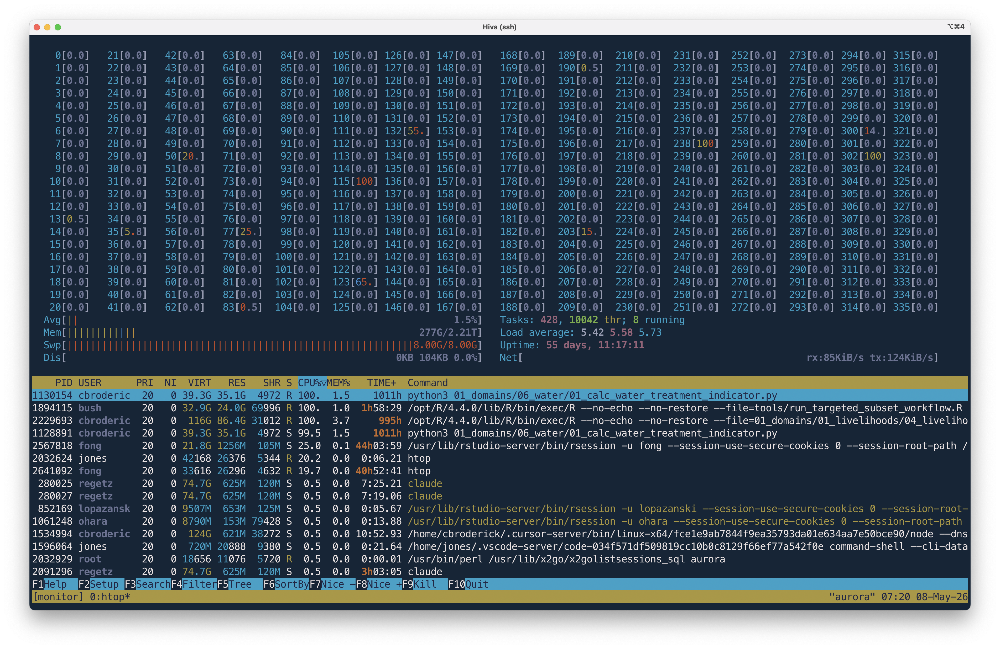

Now, if you detach from the session instead of exiting it, the session will continue to run in the background, and you can reattach to it later to check on the progress of your processes or to interact with them. To detach from a `tmux` session, use the keyboard shortcut `Ctrl` + `b` followed by `d` (for "detach"). To see a list of the sessions you have running, use `tmux ls`. To reattach to a `tmux` session, use the `tmux attach` command (optionally with the `-t session_name`).

```bash
jones@aurora:~$ tmux ls
monitor: 1 windows (created Fri May  8 07:19:34 2026)
jones@aurora:~$ tmux attach -t monitor
```

To explain that `Ctrl` + `b` + `d` keyboard shortcut a bit more: `Ctrl` + `b` is the default "prefix" for `tmux` commands, which means that you need to press that combination before any other key to send a command to `tmux`. So, to detach from the session, you first press `Ctrl` + `b` to tell `tmux` that you're about to send it a command, and then you press `d` to tell it to detach from the session. There are many other commands you can use with `tmux` to manage your sessions, such as creating new windows within a session, splitting windows into panes, resizing panes, and more.

The core concepts that you'll use most often with `tmux` are sessions, windows, and panes. 

- **session**: A session is a collection of windows from which you can attach and detach
- **window**: a window is a single terminal interface that typically runs a shell on the remote server. A session can contain multiple windows, making it super easy to switch between them.
- **pane**: a pane is a rectangular area within a window that can display a separate terminal session. Windows can be split into multiple panes, either vertically or horizontally, allowing you to view and interact with multiple terminal sessions within a single window. This is especially useful for monitoring multiple processes at the same time, or for running multiple commands in parallel, such as running a model in one pane while watching its output in another pane.

If you reattach to your session (e.g. `tmux attach -t monitor`), let's take a look at the key features of the window. You'll see that `htop` is running in the window, and you can interact with it as you normally would. In the lower left, you'll see the tmux status bar, which shows you the name of the session (`monitor`) and the names of the windows and process running (`0:htop`). In the lower right, you'll see the hostname "aurora" and the current time. 

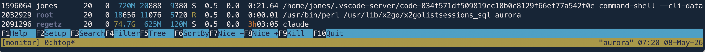

Let's **create** a new window. You can use the keyboard shortcut `Ctrl` + `b` followed by `c` to create a new window within the session. Once you do that a new terminal window will open within the session, and you can run any commands you want in that window. You can switch between windows using the keyboard shortcut `Ctrl` + `b` followed by the number of the window you want to switch to (e.g. `Ctrl` + `b` followed by `0` to switch to the first window, `Ctrl` + `b` followed by `1` to switch to the second window, etc.). The windows are listed in the status bar at the bottom of the screen, so you can see which windows you have open and which one you're currently in. 

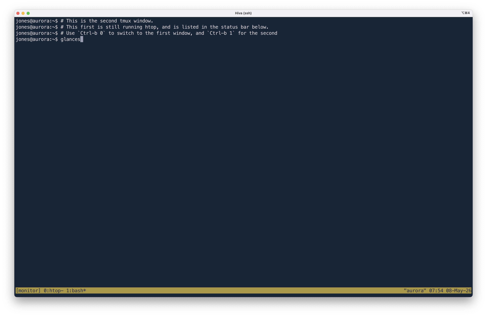

Since we just created a new window, we should see two windows listed in the status bar: `0:htop` and `1:bash`. The `0:htop` window is the one that we started with, which has `htop` running in it, and the `1:bash` window is the new window that we just created, which has a bash shell running in it. Now let's launch `glances` in the new window, and then create a third window (with `Ctrl-b c`). you should now have three windows open in your session, each with a different process running in it. You can switch between them using the keyboard shortcuts we just covered.


Next, use `Ctrl` + `b` followed by `%` to split the window vertically into two panes (or `Ctrl` + `b` followed by `"` to split the window horizontally into two panes). You can then run different commands in each pane, and use the keyboard shortcuts `Ctrl` + `b` followed by the arrow keys to switch between panes.
You can have multiple sessions running at the same time, each with its own set of windows and panes. This allows you to organize your work in a way that makes sense for you, and to easily switch between different tasks without having to open multiple terminal windows.

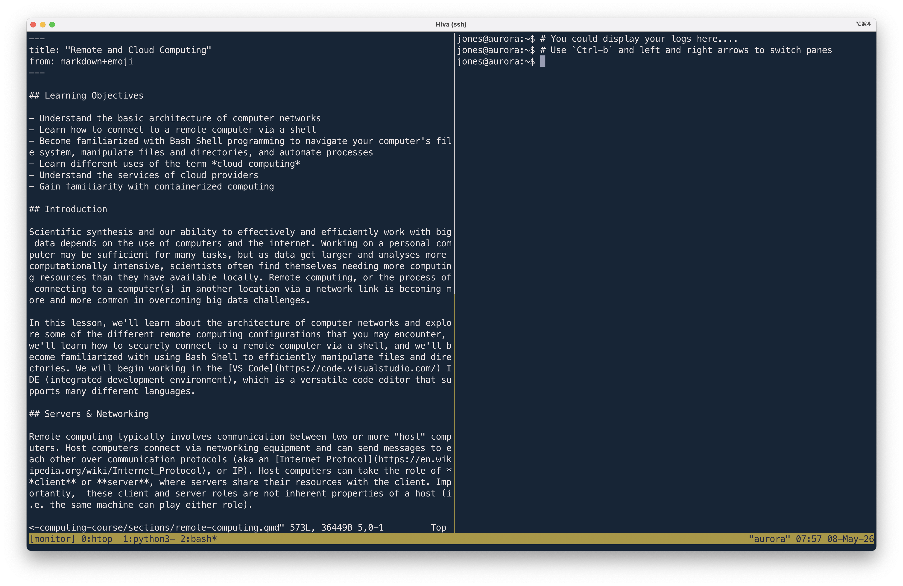

Last but not least, help is always available within `tmux` by using the keyboard shortcut `Ctrl` + `b` followed by `?`, which will bring up a list of all the keyboard shortcuts and commands that you can use with `tmux`. You can also customize the key bindings and other settings in `tmux` by editing the `.tmux.conf` configuration file in your home directory.

Remeber to detach (`Ctrl-b d`)from your session (rather than `exit`) when you plan to come back to it later or if you habe something running, and to kill the session when you no longer need it (e.g., `tmux kill-session -t monitor`), which will stop all processes running within that session and free up resources on the server.

So, `tmux` is a powerful tool that allows you to manage multiple terminal sessions within a single terminal window, and to detach and reattach to those sessions as needed. This can be especially useful when working on a remote server, as it allows you to keep your processes running even if your connection to the server is interrupted, and to easily check on the progress of your processes from different locations. You can go home, disconnect from the server, and then reattach to your `tmux` session later to check on the progress of your processes or to interact with them. All of your windows and panes will still be there, and your processes will still be running, so you can pick up right where you left off :tada:.

##  What is cloud computing anyways?

The buzzword we all hear, but maybe don't quite understand.
..

**Cloud computing is a lot of things...** *but generally speaking:*

::: {layout-ncol="2"}

[<br>Cloud computing is the delivery of on-demand computer resources over the Internet. Or just "using someone else's computer".]{.bulletgrid}

[<br>"The Cloud" is powered by a global network of data centers which house the hardware (servers), power, and backup systems, etc. These data centers and infrastructure are managed by cloud providers]{.bulletgrid}

[<br>Cloud computing services are typically offered using a "pay-as-you-go" pricing model, which in some scenarios may reduce capital expenses.]{.bulletgrid}

[<br>Cloud computing is a technology approach to using lightweight virtualization services to share large physical computing clusters across many users]{.bulletgrid}

:::

Check out this article by Ingrid Burrington in The Atlantic, [Why Amazon's Data Centers are Hidden in Spy Country](https://www.theatlantic.com/technology/archive/2016/01/amazon-web-services-data-center/423147/), for some interesting insight into one of the largest cloud provider's data centers.

### Commercial clouds

There are a lots of different cloud computing platforms, but the big ones are:

 [Amazon Web Services](https://aws.amazon.com/what-is-cloud-computing/) (AWS)<br>
 [Google Cloud Platform](https://cloud.google.com/) (GCP)<br>
 [Microsoft Azure](https://azure.microsoft.com/en-us/)


<span style = 'font-size: 70%;'>There are *many* other cloud service providers that offer varying degrees of infrastructure, ease of use, and cost. Check out [DigitalOcean](digitalocean.com), [Kamatera](https://www.kamatera.com/), and [Vultr](https://mamboserver.link/vultr) to start.</span>

### Academic clouds

::: {layout-ncol="2"}

{fig-align="center"}<br>
{fig-align="center"}<br>
{fig-align="center"}<br>
{fig-align="center"}<br>

Federal agencies in the US and other institutions also support massive computing facilities supporting cloud computing. While there are too many to fully list, programs such as the National Science Foundation's [ACCESS](https://access-ci.org) program, the Department of Energy's [National Energy Research Scientific Computing Center (NERSC)](https://cs.lbl.gov/about/divisions-and-facilities/national-energy-research-scientific-computing-center/), and the [CyVerse](https://cyverse.org/) platform  provide massive cloud computing resources to academic and agency researchers. The huge advantage is that these resources are generally free-for-use for affiliated researchers. When you need access to massive CPU and GPU hours, an application for access to these facilities can be extremely effective.

:::

And the [Pangeo](https://pangeo.io/) project is creating an open community focused on maintaining, supporting, and deploying open infrastructure for cloud computing. They support key [scientific software packages](https://pangeo.io/packages.html) used throughout the cloud community, including `xarray` and `dask`, and generally are broadening capacity for large-scale, impactful research.

### Cloud deployment options

Different cloud service and deployment models offer a suite of options to fit client needs

 **Service Models:** When you work in "the cloud" you're using resources -- including servers, storage, networks, applications, services, (and more!) -- from a very large resource pool that is managed by you or the cloud service provider. Three cloud service models describe to what extent your resources are managed by yourself or by your cloud service providers.

::: {layout-ncol="1"}

 Infrastructure as a Service (IaaS)

 Platform as a Service (PaaS)

 Software as a Service (SaaS)

:::

 **Deployment Models:** Cloud deployment models describe the type of cloud environment based on ownership, scale, and access.

::: {layout-ncol="1"}

 Private Cloud

 Public Cloud

 Hybrid Cloud

:::

### Service Models 

 **Infrastructure as a Service (IaaS)** provides users with computing resources like processing power, data storage capacity, and networking. IaaS platforms offer an alternative to on-premise physical infrastructure, which can be costly and labor-intensive. In comparison, IaaS platforms are more cost-effective (pay-as-you-go), flexible, and scalable.

One example of IaaS is [Amazon EC2](https://aws.amazon.com/ec2/), which allows users to rent virtual computers on which to run their own computer applications (e.g. R/RStudio).


 **Platform as a Service (PaaS)** provides developers with a framework and tools for creating unique applications and software. A benefit of SaaS is that developers don't need to worry about managing servers and underlying infrastructure (e.g. managing software updates or security patches). Rather, they can focus on the development, testing, and deploying of their application/software.

One example of SaaS is [AWS Lambda](https://aws.amazon.com/lambda/), a serverless, event-driven compute service that lets you run code for virtually any type of application or backend service without provisioning or managing servers.

 **Software as a Service (SaaS)** makes software available to users via the internet. With SaaS, users don't need to install and run software on their computers. Rather, they can access everything they need over the internet by logging into their account(s). The software/application owner does not have any control over the backend except for application-related management tasks.

Some examples of SaaS applications include [Dropbox](https://www.dropbox.com/), [Slack](https://slack.com/), and [DocuSign](https://www.docusign.com/).

###  An Analogy: Pizza as a Service

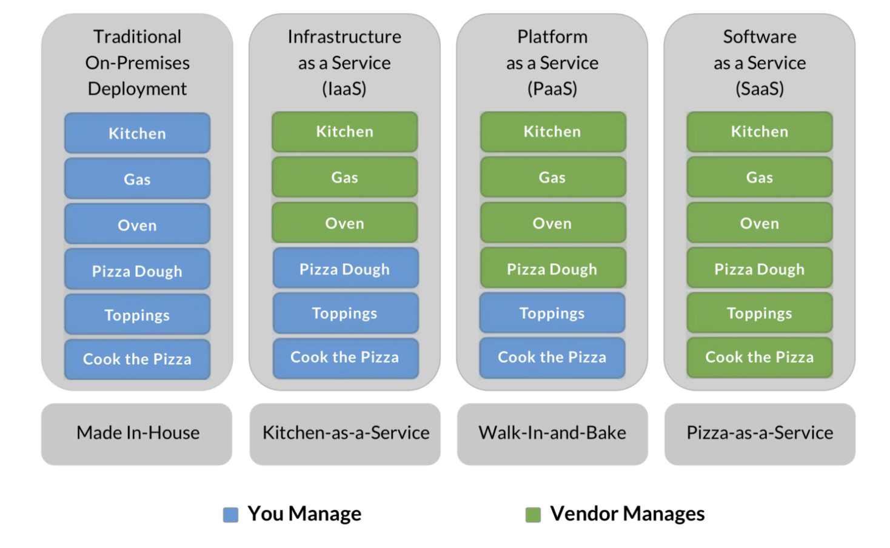

Image Source: David Ng, Oursky

## Virtual Machines and Containers

As servers grow in size, we have increasing amounts of power and resources, but also a larger space to manage. Traditional operating systems use a common memory and process management model that is shared by all users and applications, which can cause some issues if one of the users consumes all of the memory, fills the disk, or causes a kernel panic. When running on a bare server, all of the processes from all users are mixed together and are not isolated, so the actions of one process can have large consequences for all of the others.
 
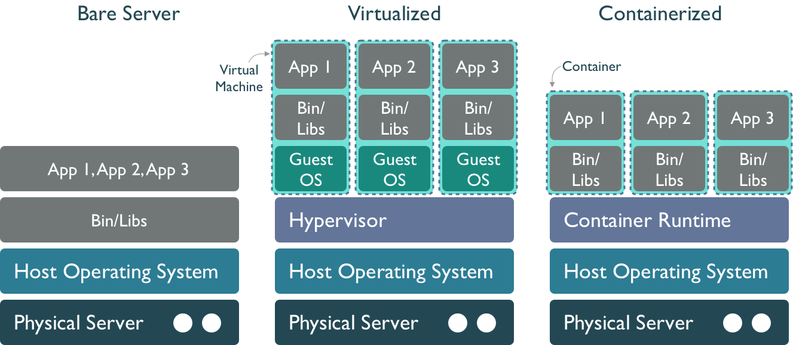

::: {layout="[[100],[70,30]]"}

**Virtual machines** Virtualization is an approach to isolate the environments of the various users and services of a system so that we can make better use of the resource, and protect processes. In a virtualized environment, the host server still runs a host operating system, which includes a hypervisor process that can mediate between guest hosts on the machine and the underlying host operating system and hardware. This is effective at creating multiple **virtual machines** (VMs) running side-by-side on the same hardware. From the outside, and to most users, virtual machines appear to be a regular host on the network, when in fact they are virtual hosts that share the same underlying physical resources. But it also results in a fair amount of redundancy, in that each virtual machine must have its own operating system, libraries, and other resources. And calls pass through the guest operating system through the hypervisor to the physical layer, which can impose a performance penalty.

**Containers** A further step down the isolation road is to use a Container Runtime such as [`containerd`](https://containerd.io/) or [Docker Engine](https://docs.docker.com/engine/). Like virtual machines, containers provide mechanisms to create images that can be executed by a container runtime, and which provide stronger isolation among deployments. But they are also more lightweight, as the container only contains the libraries and executables needed to execute a target application, and not an entire guest operating system. They also are built using a layered file system, which allows multiple images to be layered together to create a composite that provides rich services withot as much duplication. This means that applications run with fewer resources, start up and shut down more quickly, and can be migrated easily to other hosts in a network.

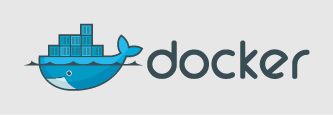

:::
