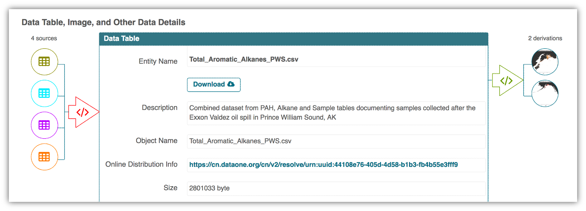
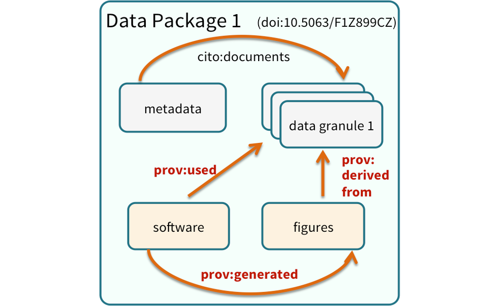
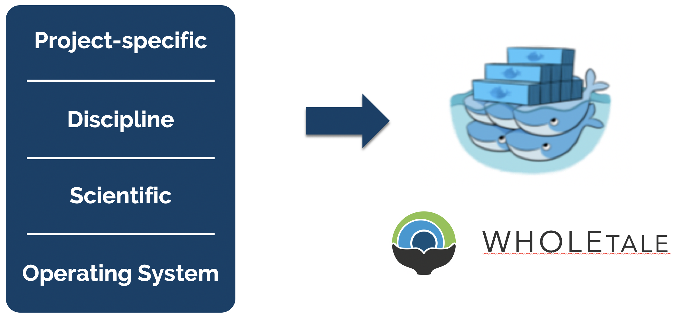
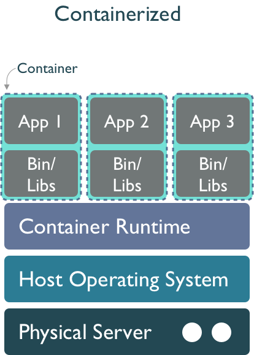

## Learning Objectives

-   Think about dependency management, reproducibility, provenance, and software management

-   Discuss how the techniques from this class can improve reproducibility and traceability

-   Related slides: [Accelerating synthesis science through reproducible science](../images/2022-09-repro-sci.pdf)

## Reproducible Science

Reproducible science is a key part of the scientific method. It is the process of ensuring that research can be repeated and verified by others. Working in a reproducible manner:

-   Makes your work easier to replicate and build upon
-   Increases research efficiency through clear documentation and streamlined collaboration
-   Makes validation of findings easier and more reliable
-   Promotes transparency in research methods, data collection, and analysis
-   Allows credit for secondary usage and supports easy attribution

To enable others to fully interpret, reproduce or build upon our research, we need to provide more comprehensive information than is typically included in a figure or publication. **The methods sections of papers and/or datasets are typically inadequate to fully reproduce the work described in the paper.**

Take this methods description as an example:

> “We obtained 10 cm diameter sediment cores from the lake using a coring device deployed from a boat. The cores were promptly transported back to the field station, where they were placed in temperature-controlled water baths maintained at the same temperature as the surrounding lake water. The water above the sediment cores was replaced with filtered (0.7 µm pore size, pre-combusted GFF filters) epilimnetic water sourced from each study lake. Dissolved oxygen concentrations in the overlying water were recorded in 5 minute intervals.”

Reproducing this work given this amount of information would be quite difficult. You might have questions like:

-   What lake were samples collected from?
-   What type of coring device was used?
-   What temperature were the water baths maintained at?
-   How were the results evaluated?
-   What documentation or code is available to us to validate the results?

**Computational reproducibility** is the ability to document data, analyses, and models sufficiently for other researchers to be able to understand and ideally re-execute the computations that led to scientific results and conclusions.

Practically speaking, reproducibility includes:

-   Preserving the data
-   Preserving the software workflow
-   Documenting what you did
-   Describing how to interpret it all

**Computational provenance** refers to the origin and processing history of data including:

-   Input data
-   Workflow/scripts
-   Output data
-   Figures
-   Methods, dataflow, and dependencies

When we put these all together with formal documentation, we create a computational workflow that captures all of the steps from initial data cleaning and integration, through analysis, modeling, and visualization. In other words, **computational provenance is a formalized description of a workflow from the origin of the data to its final outcome.**

This image is a screenshot of an interactive user interface of a workflow built by DataONE. You can clearly see which **data files** were inputs to the process, the **scripts** that are used to process and visualize the data, and the **final output** objects that are produced, in this case two graphical maps of Prince William Sound in Alaska.

These components can be bundled into a data package. A **data package** is the unit of publication of your data, including **datasets, metadata, software and provenance**. The image below represents a data package and all its components and how these components relate to one another.

## Course Highlights

In this course we reviewed many tools and techniques for how to make research more reproducible and scalable. These tools focus around three main areas: the environment, the data, and the code.

#### Reproducible Environments {.unnumbered}

-   Virtual environments with `venv` and `virtualenvwrapper`
    -   Should be easy to recreate from scratch as you don’t place any project code in the virtual environment
-   Python dependencies with `requirements.txt`
    -   List of packages and versions to be installed
-   Containers with Docker
    -   A container is a lightweight, stand-alone, executable package of software that includes everything needed to run a piece of software, including the code, runtime, libraries, environment variables, and configuration files
    -   Docker is a platform for developing, shipping, and running applications in containers
    -   Allows us to develop and deploy apps inside of neatly packaged virtual containerized environments
    -   System-agnostic, making it easier to use, maintain, & deploy

#### Accessible Data {.unnumbered}

-   Publishing with the Arctic Data Center
-   Free and openly accessible, no login required
-   Formats for large datasets:
-   NetCDF
    -   Machine-independent format for storing data
-   and Zarr
    -   Python package that stores large array data in an open standard

#### Scalable Python {.unnumbered}

-   Parallel with `concurrent.futures`, `parsl`, `dask`
-   N-dimensional data access with `xarray`
-   Reduces errors by introducing labels in the form of dimensions, coordinates, and attributes
-   Geospatial analysis with
-   `geopandas`
    -   Open-source package to manipulate dataframes
-   and `rasterio`
    -   Library that allows you to read, write, & analyze geospatial raster data
-   Software design and python packages

## Software collapse

::: {layout-ncol="2"}
In his blog post on [software collapse](https://blog.khinsen.net/posts/2017/01/13/sustainable-software-and-reproducible-research-dealing-with-software-collapse.html), Konrad Hinsen outlines the fragile state of scientific software today. While we like to think that our software is robust, in reality it is being constantly revised, expanded, broken, and abandoned, such that our use of any software today is almost certainly doomed to dysfunction shortly. Hinsen describes the science software ecosystem as having 4 layers, from **totally general operating systems** at the bottom, to **scientific infrastructure** (libraries & utilities used for research in many different disciplines), **discipline-specific software** (tools & libraries that implement models & methods which are developed & used by research communities), and finally **project-specific software** at the top (whatever it takes to do a computation using software building blocks with the 3 lower levels: e.g. scripts, workflows, notebooks, etc). Hinsen states:

](../images/arctic-data-center/hinsen-stack.png)
:::

> "There are essentially two tasks that need to be organized and financed: preventing collapse due to changes in layers 1 and 2, and implementing new models and methods as the scientific state of the art advances. These two tasks go on in parallel and are often executed by the same people, but in principle they are separate and one could concentrate on just one or the other.
>
> The common problem of both communities is collapse, and the common enemy is changes in the foundations that scientists and developers build on."

While most reproducibility work has focused at the project-specific software level, Hinsen argues that there is tremendous risk deep down in the software ecosystem. There are many examples of compatibility decisions in scientific software that create problems for long-term stability, even if they are the right decision at the time. For example, see the compatibility discussions from [numpy](https://numpy.org/neps/nep-0023-backwards-compatibility.html#example-cases) and [pandas](https://pandas.pydata.org/docs/whatsnew/v1.4.0.html#deprecations) to get a sense for the challenges faced when maintaining science software. This issue with abandoned software and lonely maintainers has become a prevalent meme in the open source software world.

](../images/xkcd-2347-dependency.png)

## Delaying the inevitable

While software is destined to continue to rot, projects like [WholeTale](https://wholetale.org), [repo2docker](https://repo2docker.readthedocs.io/), and [Binder](https://mybinder.org/) are working towards tools that can help capture more of the software stack needed to reproduce computations, thereby enabling us to freeze older versions of software and replay them in compatible combinations. Or, barring full re-execution, at least to understand them. The idea is to take advantage of containerized computing environments, which can be described as 'software as code' because containers can be declaratively described in a configuration file. While project-specific software and possibly disciplinary software dependencies might be captured in a `requirements.txt` file for python, we also need to know all of the details of lower layers, including system libraries and kernel versions. Plus data dependencies, processing workflows, and provenance. And it turns out that these very details can be captured quite effectively in a virtualized container. For example, WholeTale uses container images to record not just project-specific software dependencies, but also operating system details, data dependencies, and runtime provenance.

This is accomplished by first configuring a base image that contains core software from layers 1 and 2, and then researchers work within common tools like Jupyter and RStudio to create their scientific products at layers 3 and 4. These can then be captured in virtual environments, which get added to the container configuration, along with key details such as external data dependencies and process metadata. All of this can be serialized as a "Tale", which is basically an archival package bundled around a container image definition.

::: {layout-ncol="2"}
This approach combines the evolving approach to using a `Dockerfile` to precisely configure a container environment with the use of structured metadata and provenance information to create an archival-quality research artifact. These WholeTale **tales** can be downloaded to any machine with a container runtime and executed under the same conditions that were used when the original tale was archived.

:::

## Discussion

To wrap up this week, let's kick off a discussion with a couple of key questions.

-   As we learn new tools for scalable and reproducible computing, what can software creators do to improve robustness and ease maintenance of packages?
-   Given the fragility of software ecosystems, are you worried about investing a lot of time in learning and building code for proprietary cloud systems? Can we compel vendors to keep their systems open?
-   What relative fraction of the research budget should funders invest in software infrastructure, data infrastructure, and research outcomes?
